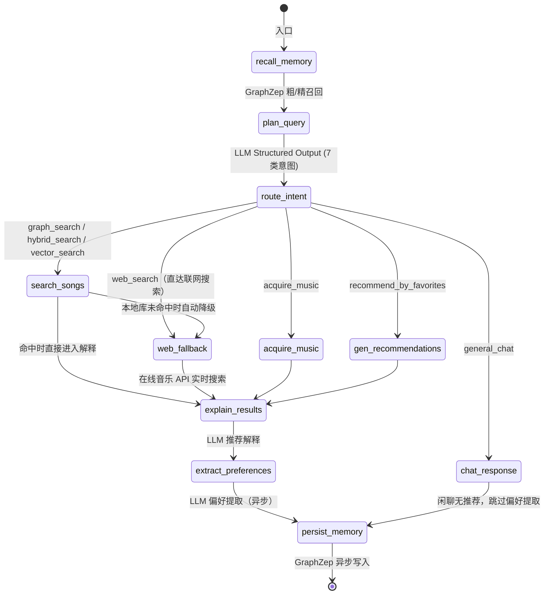
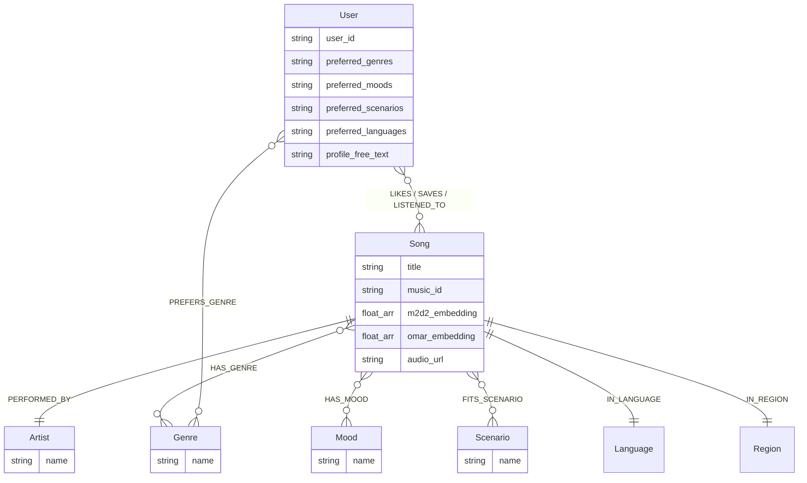

# 🎵 SoulTuner Agent

<p align="center">
  
</p>

<p align="center">
  <strong>多模态音乐推荐智能体 — Hybrid RAG × Knowledge Graph × Long-term Memory</strong>
</p>

<p align="center">
  
  
  
  
  
  
  <br/>
  
  
  
</p>

<p align="center">
  <a href="README.md">中文</a> | <a href="README_EN.md">English</a>
</p>

## 🎯 用自然语言发现音乐，让 AI 真正听懂你

SoulTuner 是一款**本地部署**的 AI 音乐推荐智能体。它不是简单的"搜歌→播放"工具，而是一个能**持续学习你音乐品味**的私人 DJ：

- 🗣️ **用自然语言描述你想听的** — "我今天心情特别差，想一个人静一静"，系统自动识别情绪与场景，推荐契合当下状态的音乐
- 🧠 **越用越懂你** — 每一次点赞、收藏、跳过和对话，都在无声构建你的个性化音乐画像，下次推荐更精准
- 🌐 **本地曲库不够？实时联网补充** — 当本地库无法满足需求时，自动联网搜索最新音乐资讯
- 🗺️ **沉浸式音乐旅程** — 描述一段故事或场景，AI 为你编排一整段有起承转合的音乐旅程
- ♻️ **发现→暂存→入库** — 推荐中遇到好歌？先下载到「待入库」预览试听，确认后一键入库并自动进行声学分析

> 📖 完整功能与交互细节请参阅 [Feature_Walkthrough.md](Feature_Walkthrough.md)
>
> 融合知识图谱（Neo4j）、双模型音频向量（M2D-CLAP + OMAR-RQ）、大语言模型和 GraphZep 长期记忆，通过 LangGraph 编排的多节点 Agent 工作流，实现多路混合检索、加权 RRF 融合、Neo4j 图距离加权、SSE 流式推荐、联网搜索回退、音乐旅程编排和用户行为数据飞轮。

---

## ✨ 核心特性

| 特性                       | 说明                                                                 |
| -------------------------- | -------------------------------------------------------------------- |
| 🔀**Hybrid RAG**     | GraphRAG + Semantic Search 并发检索，平等合并去重 + 三锚归一化精排   |
| 🎵**双模型音频向量** | M2D-CLAP 跨模态语义 + OMAR-RQ 声学特征，三锚归一化融合（权重可调）   |
| 🧠**长期记忆**       | GraphZep 双阶段召回，跨会话保留用户偏好                              |
| 📊**粗排+探索**      | Graph Affinity 粗排截断 + Thompson Sampling 冷门探索槽               |
| 🤖**智能意图识别**   | 7 类意图分类 + DST 多轮标签继承，支持 API 大模型 + 本地 Qwen3-4B     |
| 👤**用户画像**       | 前端可视化画像面板，流派/情绪/场景/语言偏好 → Neo4j + GraphZep 双写 |
| 🌐**联网搜索回退**   | 本地库不足时自动触发 SearxNG 联邦搜索 + LLM 摘要                     |
| 🎼**音乐旅程**       | LLM 故事→情绪拆解→逐段检索，SSE 实时推送                           |
| ♻️**数据飞轮**     | 下载→暂存→试听→确认入库→标签提取→向量编码→Neo4j                |
| 📋**曲库管理**       | 待入库暂存区 + 我的曲库全图谱管理（搜索/播放/删除）                  |
| 📡**SSE 流式**       | 前端实时渲染 thinking → 歌曲卡片 → 推荐理由                        |
| 🐳**Docker 部署**    | `docker compose up` 一键启动全栈                                   |

---

## 🖼️ 功能预览

<div align="center">
<h3>🎬 快速了解 SoulTuner 的功能</h3>
<p>
  <a href="https://www.bilibili.com/video/BV11dQLBDEeF/">
    
  </a>
</p>
</div>

### 🏠 首页 · 💬 对话 · 🎵 推荐 · 🎧 播放 · 🗺️ 旅程

<table>
  <tr>
    <td></td>
    <td></td>
  </tr>
  <tr>
    <td></td>
    <td></td>
  </tr>
  <tr>
    <td colspan="2"></td>
  </tr>
</table>

---

## 🏗️ 系统架构

```
┌─────────────────────────────────────────────────────────────────────┐
│  Frontend (Next.js :3003)                                           │
│  React UI  ·  Global Audio Player  ·  Music Journey  ·  Settings   │
└──────────────────────────────┬──────────────────────────────────────┘
                               │ SSE
┌──────────────────────────────▼──────────────────────────────────────┐
│  Backend (FastAPI :8501)                                            │
│  SSE Streaming API  ·  Settings API  ·  Static Audio Server        │
└──────────────────────────────┬──────────────────────────────────────┘
                               │
┌──────────────────────────────▼──────────────────────────────────────┐
│  LangGraph Agent (StateGraph)                                       │
│                                                                     │
│  start → GraphZep Recall → Planner (LLM) → Intent Router          │
│                                                                     │
│     ┌─────────┬─────────┬─────────┬──────────┐                     │
│     ▼         ▼         ▼         ▼          ▼                     │
│  search_songs  chat  acquire  gen_reco  journey                    │
│     │                                                               │
│     ▼                                                               │
│  Hybrid Retrieval ──→ LLM Explainer ──→ Pref Extract ──→ GraphZep Write → end │
└──────────────────────────────┬──────────────────────────────────────┘
                               │
┌──────────────────────────────▼──────────────────────────────────────┐
│  Hybrid Retrieval Engine                                            │
│                                                                     │
│  ┌─────────────┐  ┌──────────────────┐  ┌──────────────┐          │
│  │  GraphRAG   │  │  Semantic Search  │  │  Web Search  │          │
│  │  Neo4j      │  │  M2D-CLAP+OMAR   │  │  SearxNG     │          │
│  └──────┬──────┘  └────────┬─────────┘  └──────┬───────┘          │
│         └──────────────────┼───────────────────┘                   │
│                            ▼                                        │
│              Merge & Dedup (平等合并去重)                            │
│                            ▼                                        │
│              Coarse Rank (Graph Affinity 粗排截断)                   │
│                            ▼                                        │
│              Thompson Sampling (冷门歌探索槽)                        │
│                            ▼                                        │
│              Tri-Anchor Rerank (语义+声学+个性化 归一化精排)         │
│                            ▼                                        │
│              MMR Multi-dim Diversity (λ=0.7)                       │
└─────────────────────────────────────────────────────────────────────┘
                               │
┌──────────────────────────────▼──────────────────────────────────────┐
│  Storage Layer                                                      │
│  Neo4j (Graph + Vectors)  ·  GraphZep Memory (:3100)               │
└─────────────────────────────────────────────────────────────────────┘
```

### 技术栈

| 层                   | 技术                                                                                    |
| -------------------- | --------------------------------------------------------------------------------------- |
| **前端**       | Next.js 14 + React 18                                                                   |
| **Agent**      | LangGraph StateGraph（7 类意图路由）                                                    |
| **后端**       | FastAPI + SSE 流式推送                                                                  |
| **图数据库**   | Neo4j 5.x（原生向量索引 + 图谱关系 + 用户行为直写）                                     |
| **音频嵌入**   | M2D-CLAP 2025（跨模态语义，768d）+ OMAR-RQ（纯声学特征，1024d）                         |
| **大语言模型** | DeepSeek-V3.2 / Gemini / 豆包（火山引擎）/ 通义千问（API）+ Qwen3-4B（SGLang 本地部署） |
| **长期记忆**   | GraphZep 时序记忆（双阶段召回）                                                         |
| **联网搜索**   | SearxNG 联邦搜索 + Tavily + 智谱 WebSearch                                              |
| **排序算法**   | 三锚归一化精排（语义+声学+个性化）+ Graph Affinity 粗排 + Thompson Sampling 探索 + MMR  |
| **上下文管理** | GSSC Token 预算管线（Gather/Select/Structure/Compress + 异步预压缩缓存）                |
| **容器化**     | Docker Compose（Neo4j + GraphZep + Backend + Frontend）                                 |

> 📖 完整技术栈与前端工程实现细节请参阅 [Technical_Report.md](Technical_Report.md)

---

## 🔬 技术深度

### RAG 混合检索流水线

```
用户查询 → Planner (LLM) + DST 多轮标签继承
              ↓  intent_type + retrieval_plan
   ┌──────────┼──────────┐
   ▼          ▼          ▼
GraphRAG   VectorKNN  WebSearch       ← Step 1: 多路并发召回
(Cypher)  (M2D+OMAR) (SearxNG)
   └──────────┼──────────┘
              ▼
  Step 2: 平等合并去重                 ← 替代旧版加权 RRF
              ▼
  Step 2.5: DISLIKES 过滤             ← 排除用户明确不喜欢的歌
              ▼
  Step 3: Artist 多样性初筛            ← 每歌手 ≤ N 首（指定歌手豁免）
              ▼
  Step 4: 粗排截断 + TS 探索           ← Graph Affinity 排序 → 保留 65% → 尾部 Thompson Sampling 捞回冷门歌
              ▼
  Step 5: 三锚归一化精排               ← 语义(M2D-CLAP) + 声学(OMAR-RQ) + 个性化(Graph Affinity MinMax)
              ▼
  Step 6: MMR 多维多样性重排           ← genre + mood + theme + scenario
              ▼
  Step 7: FinalCut (≤ 15 首)          ← 安全去重 + 截断
```

**关键设计决策**：

- **GraphRAG Typed Entity 精确匹配**：Planner 将实体拆分为 `graph_artist_entities`（歌手名）和 `graph_song_entities`（歌曲名），GraphRAG 执行 `Artist.name AND Song.title` 精确 AND 匹配（取代旧版扁平 tags 的 OR 模糊匹配），显著减少同名歌手/歌曲混淆，必须同时包含中英文原文+翻译以兼容双语图谱
- **GraphRAG 五维标签过滤**：在 Typed Entity 之外，保留 genre / scenario / mood / language / region 五维过滤，200+ 中英文别名映射
- **双模型向量**：M2D-CLAP 跨模态语义 + OMAR-RQ 纯声学，三锚归一化精排融合
- **粗排 + Thompson Sampling**：Graph Affinity 分数排序后截断（`coarse_cut_ratio=65%`），尾部候选通过 TS 采样（`Beta(α,β)` 分布）以概率方式捞回冷门歌进入精排，实现探索-利用平衡
- **三锚归一化精排**：语义锚 `(cosine+1)/2`（M2D-CLAP）+ 声学锚 `(cosine+1)/2`（OMAR-RQ 质心）+ 个性化锚 `MinMax`（Graph Affinity），三维度归一化到 [0,1] 后加权融合（权重前端可调，自动归一化使 α+β+γ=1）
- **DST 多轮标签继承**：Planner 通过 `retrieval_plan` 状态保持上轮的检索意图和标签（genre/mood/language/声学语义），追问时自动叠加新约束（如上轮=Pop → 追问"更忧伤的" → 保留 Pop + 追加 Sad）
- **MMR Jaccard**：利用候选歌的 `{genre, mood, theme, scenario}` 多维标签计算 Jaccard 相似度实现多样性重排

### Agent 工作流



> 意图识别支持 API 大模型（DeepSeek-V3.2 等）和本地 Qwen3-4B（SGLang 部署）双模式。本地模式下 HyDE 声学描述由独立模块生成。

> `web_search` 意图现在直接路由到 `web_fallback` 节点（在线音乐 API 实时搜索），不再经过 HybridRetrieval。支持中文原文优先、多级查询词提取和 30s 试听版本检测。

> 偏好提取为独立 LangGraph 节点 `extract_preferences`，闲聊意图自动跳过。

### 记忆系统

| 组件                          | 说明                                                                                                                 |
| ----------------------------- | -------------------------------------------------------------------------------------------------------------------- |
| **GraphZep 双阶段**     | Stage 1 粗召回 → Stage 2 精排（相似度 + 时间衰减），跨会话保留用户偏好                                              |
| **GSSC Token 预算**     | facts + chat_history 动态分配，支持 LLM 摘要压缩 + 异步预压缩缓存                                                    |
| **Neo4j 偏好图谱**      | 每轮对话自动提取用户偏好，异步写入 User 节点；行为事件（like/save/skip/dislike）直写关系边                           |
| **用户画像双写**        | 前端画像面板 → 同时写入 Neo4j User 节点属性 + GraphZep 长期记忆                                                     |
| **Profile Synthesizer** | 动态画像合成器：聚合长期记忆 + 行为统计（played/liked/skipped 计数）→ 自动生成结构化用户画像，供 Planner 上下文注入 |

**记忆架构要点**：

- Neo4j 负责**精确行为关系**（LIKES / SAVES / LISTENED_TO / SKIPPED / DISLIKES），查询快（Bolt 直写 ~100ms）
- GraphZep 负责**模糊语义记忆**（自然语言描述用户喜好），通过 BGE-M3 向量检索，补充 Planner 上下文
- Profile Synthesizer 在对话轮次触发时异步聚合两路记忆，生成可读的 `portrait` 注入到当轮 Planner 提示词

### 用户画像系统

前端画像面板保存用户偏好（流派/情绪/场景/语言），同时写入 Neo4j User 节点属性和 GraphZep 长期记忆。检索排序时通过 Graph Affinity 读取偏好，计算 Jaccard 相似度为候选歌加分。Profile Synthesizer 自动聚合行为统计和记忆片段，为每次对话提供个性化上下文注入。

### 数据飞轮

用户搜索 → 发现新歌 → 下载到「待入库」暂存区 → 前端试听预览 → 勾选确认入库 → LLM 标签提取 + 双模型向量编码 → Neo4j 入库 → 下次检索可命中

> 💡 联网获取的歌曲不再自动入库，用户可在「我的曲库」页面管理已入库歌曲（播放/搜索/删除）。

### 工程质量

| 维度                 | 说明                                                                         |
| -------------------- | ---------------------------------------------------------------------------- |
| **CI/CD**      | GitHub Actions — 每次 push 自动运行 `ruff` 代码检查 + `pytest` 单元测试 |
| **单元测试**   | 51 tests / 5 模块（key 标准化、Token 预算、标签映射、合并去重、Schema 校验） |
| **意图评测**   | 55 条手工标注覆盖全部 7 种意图类型，批量测试准确率**98.2%**（54/55）   |
| **Token 追踪** | GSSC 管线内置结构化 Token 消耗报告（Before/After/Savings 对比）              |
| **状态持久化** | LangGraph MemorySaver Checkpoint（内存级，可替换为 Sqlite/Postgres）         |
| **代码规范**   | Ruff 静态检查 + pyproject.toml 统一配置                                      |

<details>
<summary>意图分类评测详情</summary>

```
评测日期: 2026-04-09
模型: DeepSeek-V3.2 (SiliconFlow)
测试集: 55 条手工标注 (tests/eval/intent_test_queries.json)

Intent Type          Correct   Total   Accuracy
────────────────────────────────────────────────
graph_search              15      15     100.0%
hybrid_search             19      20      95.0%
vector_search              6       6     100.0%
web_search                 4       4     100.0%
general_chat               4       4     100.0%
acquire_music              3       3     100.0%
recommend_by_favorites     3       3     100.0%
────────────────────────────────────────────────
TOTAL                     54      55      98.2%
平均延迟: 11.55s/query（含意图分类 + 实体提取 + 标签推断 + HyDE 声学描述生成，单次 LLM 调用）
```

运行评测：

```bash
python -m tests.eval.evaluate_intent --provider siliconflow
```

</details>

---

## 📊 Neo4j 知识图谱



**向量索引**：`song_m2d2_index`（768d, cosine）+ `song_omar_index`（1024d, cosine）

---

## 🚀 快速开始

Windows 推荐使用统一入口：

```powershell
.\soultuner.ps1 doctor
.\soultuner.ps1 up lite       # 无 GPU：Neo4j + API + 前端
.\soultuner.ps1 up standard   # 加 GraphZep + SearxNG
.\soultuner.ps1 up full       # 加独立音乐入库 Worker
```

无外部服务自测：

```powershell
.\soultuner.ps1 mock
```

部署档位、端口和在线新歌入库流程见 [DEPLOYMENT_PROFILES.md](DEPLOYMENT_PROFILES.md)。

部署分为三步：**① 前置准备** → **② 选择部署方式启动服务** → **③ 数据导入**。

---

### Step 1：前置准备（两种部署方式共用）

**1.1 音乐数据**：将 MP3 文件放入 `data/processed_audio/audio/` 目录（路径可在 `.env` 中自定义）。

**1.2 环境变量**：

```bash
cp .env.example .env
# 编辑 .env：至少填入 SiliconFlow_API_KEY 和 NEO4J_PASSWORD
```

**1.3 模型权重下载**（首次必须，约 **2.4 GB**）：

```bash
# 需要先安装 Python 依赖（后续 Step 3 数据导入也需要此环境）
conda create -n music_agent python=3.11 && conda activate music_agent
pip install -r requirements.txt

# 下载模型权重（自动检测已有文件并跳过）
python scripts/download_models.py
```

| 模型                  | 大小    | 用途                                  | 存放位置                  |
| --------------------- | ------- | ------------------------------------- | ------------------------- |
| M2D-CLAP 2025         | ~1.6 GB | 运行时文本↔音频跨模态编码 + 双锚精排 | `~/.cache/m2d_clap/`    |
| BERT-base-uncased     | ~440 MB | M2D-CLAP 内部文本编码器               | `~/.cache/huggingface/` |
| OMAR-RQ multicodebook | ~400 MB | 数据入库时提取音频特征向量            | `~/.cache/huggingface/` |

> 💡 GraphZep 嵌入直接调用 SiliconFlow API (`BAAI/bge-m3`)，无需预下载。

---

### Step 2：选择部署方式

<table>
<tr><th></th><th>方式 A：Docker Compose（推荐）</th><th>方式 B：本地开发（Conda）</th></tr>
<tr><td><b>适用场景</b></td><td>快速体验、演示部署</td><td>日常开发、调试代码</td></tr>
<tr><td><b>Neo4j</b></td><td>容器自带，自动启动</td><td>需手动安装 <a href="https://neo4j.com/download/">Neo4j Desktop</a> 并启动</td></tr>
<tr><td><b>GraphZep</b></td><td>容器自带，自动启动</td><td>由 <code>startup_all.py</code> 自动启动</td></tr>
</table>

#### 方式 A：Docker Compose（推荐）

> 后端镜像约 **11 GB**（含 PyTorch + M2D-CLAP 运行库）。模型权重通过 volume 挂载宿主机缓存，不打包进镜像。
>
> ⚠️ **GPU 要求**：`docker-compose.yml` 默认开启 NVIDIA GPU 加速（用于 M2D-CLAP 跨模态推理）。需要宿主机已安装 [NVIDIA Container Toolkit](https://docs.nvidia.com/datacenter/cloud-native/container-toolkit/install-guide.html)。如无 GPU，请注释掉 `deploy.resources` 段。

```bash
# 编辑 .env 中的 Docker 专用路径（download_models.py 运行后会输出）：
#   MUSIC_DATA_PATH   = 你的音频数据目录
#   M2D_CLAP_CACHE    = M2D-CLAP 模型权重目录
#   HF_HOME           = HuggingFace 模型缓存目录

# 一键启动（Neo4j + GraphZep + Backend + Frontend）
docker compose up -d

# ★ 实时跟踪后端启动日志（推荐首次启动时使用，可看到预热进度）
docker logs -f soultuner-backend

# 你会看到类似输出：
#   🚀 开始预加载关键组件...
#   ✅ M2D-CLAP 模型预加载完成 (14.9s)
#   ✅ Agent 实例预初始化完成 (14.9s)
#   ✅ Neo4j 连接预热完成 (15.8s)
#   🏁 预加载完成，总耗时 15.8s
# 按 Ctrl+C 退出日志跟踪（不会停止容器）

# 查看所有服务状态
docker compose ps

# 访问
# 前端: http://localhost:3003 | 后端 API: http://localhost:8501 | Neo4j: http://localhost:7474
```

<details>
<summary>Docker 常用运维命令</summary>

| 命令                                        | 说明                                           |
| ------------------------------------------- | ---------------------------------------------- |
| `docker logs -f soultuner-backend`        | 实时跟踪后端日志                               |
| `docker logs --tail 50 soultuner-backend` | 查看最后 50 行日志                             |
| `docker compose up -d --build backend`    | 代码修改后重新构建并启动后端                   |
| `docker compose restart backend`          | 重启后端（不重新构建）                         |
| `docker compose down`                     | 停止并移除所有容器                             |
| `docker compose down -v`                  | 停止并清除所有数据卷（⚠️ 会删除 Neo4j 数据） |

</details>

#### 方式 B：本地开发（Conda）

> ⚠️ 需先安装并启动 [Neo4j Desktop](https://neo4j.com/download/)，在 `.env` 中配置对应的 `NEO4J_URI` 和 `NEO4J_PASSWORD`。

```bash
# Step 1 中已创建 Conda 环境，安装前端依赖
cd web && npm install && cd ..

# 一键启动所有服务（后端 + 前端 + GraphZep + SearxNG）
python startup_all.py

# 或前后端分离开发
conda activate music_agent;python startup_all.py --no-web    # 终端 A：后端
cd web && npm run dev             # 终端 B：前端（热更新）
```

<details>
<summary>手动分步启动</summary>

| 终端 | 命令                                                   | 端口      |
| ---- | ------------------------------------------------------ | --------- |
| 0    | Neo4j Desktop 启动数据库                               | `:7687` |
| 1    | `cd graphzep_service/server && npm run dev`          | `:3100` |
| 2    | `python start.py --mode api`                         | `:8501` |
| 3    | `cd web && npm run dev`                              | `:3003` |
| 4    | `docker compose -f docker-compose.searxng.yml up -d` | `:8888` |

</details>

启动成功后，请跳转到 **Step 3 数据导入**。

---

### Step 3：数据导入（首次必须，两种方式都需要）

无论使用哪种部署方式，首次启动后 Neo4j 都是空库，必须执行数据导入后才能正常推荐。

```bash
conda activate music_agent

# ── Docker 部署需要显式指定 Neo4j 连接地址 ──
# Linux/Mac:
export NEO4J_URI=bolt://127.0.0.1:7687 NEO4J_PASSWORD=12345678
# Windows PowerShell:
$env:NEO4J_URI="bolt://127.0.0.1:7687"; $env:NEO4J_PASSWORD="12345678"

# ── 本地部署已在 .env 中配置，无需额外设置 ──

# 1. 歌词标签提取（LLM 自动化，如已有 lyrics_analysis.json 可跳过）
python data/pipeline/lyrics_analyzer.py

# 2. 入库 Neo4j（元数据 + 歌词标签 + 音频向量，需要 GPU）
python data/pipeline/ingest_to_neo4j.py

# 无 GPU 可跳过向量，仅写入元数据和标签（几分钟完成）
python data/pipeline/ingest_to_neo4j.py --skip-embeddings

# 仅补充向量（之前 --skip-embeddings 后再补）
python data/pipeline/ingest_to_neo4j.py --update-embeddings
```

> ✅ 数据持久化到 Neo4j（Docker 使用 volume、本地使用 Neo4j Desktop 数据库），后续启动无需重复执行。

> 📖 数据集管理 CLI 工具（查看分布 / 验证索引 / 回填标签）详见 [Technical_Report.md](Technical_Report.md)

---

### 可选：本地大模型部署（WSL + SGLang）

针对 8GB 显存（如 RTX 4070）设备的优化部署方案，支持本地运行 Qwen3-4B 模型辅助意图识别。

1. **终端A (WSL)**：启动大模型推理引擎

   ```bash
   wsl
   bash /path/to/SoulTuner-Agent/scripts/start_sglang.sh
   ```

2. **终端B (Windows)**：在前端设置面板切换为本地模型

   - 正常运行 `python startup_all.py`
   - 打开系统设置 ⚙️ → **主提供商**选择 `sglang` → 保存

---

## 📁 项目结构

```
.
├── agent/                      # LangGraph Agent
│   ├── music_agent.py          # Agent 主入口
│   └── music_graph.py          # StateGraph 工作流（7 意图路由）
│
├── api/                        # FastAPI 接口层
│   ├── server.py               # 主服务 + Settings API
│   └── user_profile.py         # 用户画像 API（GET/POST /api/user-profile）
│
├── config/settings.py          # 全局配置（支持运行时修改）
│
├── retrieval/                  # 检索引擎层
│   ├── hybrid_retrieval.py     # 多路融合 + 粗排(Graph Affinity+TS) + 三锚精排 + MMR
│   ├── gssc_context_builder.py # GSSC 上下文管线（Token 预算 + LLM 压缩 + 异步预压缩缓存）
│   ├── audio_embedder.py       # M2D-CLAP 跨模态编码
│   ├── neo4j_client.py         # Neo4j 连接封装
│   ├── music_journey.py        # 音乐旅程编排器
│   └── user_memory.py          # 用户偏好 Neo4j 记忆
│
├── tools/                      # 工具层
│   ├── graphrag_search.py      # 知识图谱检索（Neo4j Cypher，五维标签）
│   ├── semantic_search.py      # 向量检索（M2D-CLAP + OMAR）
│   ├── web_search_aggregator.py # 联网搜索聚合（SearxNG + Tavily）
│   └── acquire_music.py        # 数据飞轮（下载到待入库 + 按需入库）
│
├── llms/                       # LLM 接口 + Prompts
│   ├── prompts.py              # Planner Prompt + 辅助 Prompt
│   ├── registry.py             # Provider 注册表 + 环境变量注入
│   ├── chat_models.py          # LangChain ChatModel 工厂
│   ├── native.py               # 原生 LiteLLM 字符串调用器
│   └── multi_llm.py            # 兼容旧 import 的门面
│
├── schemas/                    # Pydantic 数据模型
│   └── query_plan.py           # MusicQueryPlan + RetrievalPlan
│
├── services/                   # 外部服务客户端（GraphZep）
│
├── data/pipeline/              # 数据管线
│   ├── ingest_to_neo4j.py      # Neo4j 入库
│   ├── neo4j_schema_v2.py      # 数据集管理工具
│   └── lyrics_analyzer.py      # LLM 歌词标签分析
│
├── web/                        # Next.js 前端
│   ├── components/Settings/    # ⚙️ 运行时设置面板
│   ├── components/Profile/     # 👤 用户画像面板
│   └── components/Navigation/  # 导航、侧边栏
│   └── app/library/            # 音乐库页面（待入库 / 我的曲库 / 喜欢 / 收藏）
│
├── graphzep_service/           # GraphZep 微服务
├── tests/                      # 测试与评测
│   ├── unit/                   # 单元测试 (51 tests, pytest)
│   │   ├── test_normalize_key.py
│   │   ├── test_gssc_token_budget.py
│   │   ├── test_tag_expansion.py
│   │   ├── test_merge_dedup.py
│   │   └── test_schema_validation.py
│   └── eval/                   # 意图分类评测
│       ├── intent_test_queries.json  # 55 条标注数据
│       └── evaluate_intent.py        # 评测脚本
├── .github/workflows/ci.yml    # GitHub Actions CI
├── docker-compose.yml          # Docker 全栈编排
├── Dockerfile                  # 后端镜像
├── pyproject.toml              # 项目配置 (mypy + ruff + pytest)
├── .env.example                # 环境变量模板
├── startup_all.py              # 本地一键启动器
└── requirements.txt            # Python 依赖
```

---

## ⚙️ 配置

### 环境变量

| 变量                    | 说明              | 默认值                                       |
| ----------------------- | ----------------- | -------------------------------------------- |
| `OPENAI_BASE_URL`     | LLM API 地址      | `https://api.siliconflow.cn/v1`            |
| `OPENAI_API_KEY`      | LLM API 密钥      | —                                           |
| `MODEL_NAME`          | 主推理模型        | `deepseek-ai/DeepSeek-V3.2`                |
| `VOLCENGINE_BASE_URL` | 火山引擎 API 地址 | `https://ark.cn-beijing.volces.com/api/v3` |
| `VOLCENGINE_API_KEY`  | 火山引擎 API 密钥 | 可选                                         |
| `NEO4J_URI`           | Neo4j 连接        | `neo4j://127.0.0.1:7687`                   |
| `NEO4J_PASSWORD`      | Neo4j 密码        | —                                           |
| `TAVILY_API_KEY`      | 联网搜索          | 可选                                         |
| `GOOGLE_API_KEY`      | Gemini API        | 可选                                         |

> 📖 运行时设置面板（LLM 切换 / 检索参数 / RRF 权重等）及 API 端点文档详见 [Technical_Report.md](Technical_Report.md)

---

## 🙏 致谢

本项目初始架构参考自 [imagist13/Muisc-Research](https://github.com/imagist13/Muisc-Research)，在此基础上进行了大规模重构与功能扩展。

| 项目                                                 | 用途                |
| ---------------------------------------------------- | ------------------- |
| [aexy-io/graphzep](https://github.com/aexy-io/graphzep) | GraphZep 长期记忆   |
| [nttcslab/m2d](https://github.com/nttcslab/m2d)         | M2D-CLAP 跨模态模型 |
| [MTG/omar](https://github.com/MTG/omar)                 | OMAR-RQ 音频模型    |

---

## 📚 参考文献

1. Niizumi, D. et al. (2025). *M2D-CLAP: Exploring General-purpose Audio-Language Representations Beyond CLAP.*
2. Alonso-Jiménez, P. et al. (2025). *OMAR-RQ: Open Music Audio Representation Model Trained with Multi-Feature Masked Token Prediction.*
3. Rasmussen, P. et al. (2025). *Zep: A Temporal Knowledge Graph Architecture for Agent Memory.*
4. Palumbo, E. et al. (Spotify, 2025). *You Say Search, I Say Recs: A Scalable Agentic Approach to Query Understanding and Exploratory Search.* (RecSys 2025)
5. D'Amico, E. et al. (Spotify, 2025). *Deploying Semantic ID-based Generative Retrieval for Large-Scale Podcast Discovery at Spotify.*
6. Penha, G. et al. (2025). *Semantic IDs for Joint Generative Search and Recommendation.* (RecSys 2025 LBR)
7. Palumbo, E. et al. (2025). *Text2Tracks: Prompt-based Music Recommendation via Generative Retrieval.*
8. Xu, S. et al. (2025). *Climber: Toward Efficient Scaling Laws for Large Recommendation Models.*
9. Wang, S. et al. (2025). *Knowledge Graph Retrieval-Augmented Generation for LLM-based Recommendation.* (ACL 2025)

---

## 📄 许可证

MIT License

⚠️ **免责声明**：本项目仅供学习与架构研究，**严禁商业用途**。不提供、不包含也不分发任何受版权保护的音频或歌词资源。音频数据需用户自行通过合法渠道获取。
