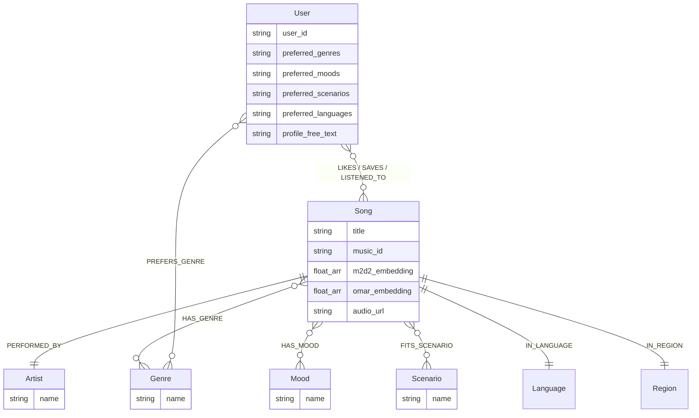

# 🎵 SoulTuner Agent

<p align="center">
  
</p>

<p align="center">
  <strong>多模态音乐推荐智能体 — Hybrid RAG × Knowledge Graph × Long-term Memory</strong>
</p>

<p align="center">
  
  
  
  
  
  
  <br/>
  
  
  
</p>

<p align="center">
  <a href="README.md">中文</a> | <a href="README_EN.md">English</a>
</p>

## 🎯 用自然语言发现音乐，让 AI 真正听懂你

SoulTuner 是一款**本地部署**的 AI 音乐推荐智能体。它不是简单的"搜歌→播放"工具，而是一个能**持续学习你音乐品味**的私人 DJ：

- 🗣️ **用自然语言描述你想听的** — "我今天心情特别差，想一个人静一静"，系统自动识别情绪与场景，推荐契合当下状态的音乐
- 🧠 **越用越懂你** — 每一次点赞、收藏、跳过和对话，都在无声构建你的个性化音乐画像，下次推荐更精准
- 🌐 **本地曲库不够？实时联网补充** — 当本地库无法满足需求时，自动联网搜索最新音乐资讯
- 🗺️ **沉浸式音乐旅程** — 描述一段故事或场景，AI 为你编排一整段有起承转合的音乐旅程
- ♻️ **发现→暂存→入库** — 推荐中遇到好歌？先下载到「待入库」预览试听，确认后一键入库并自动进行声学分析

> 📖 完整功能与交互细节请参阅 [Feature_Walkthrough.md](Feature_Walkthrough.md)
>
> 融合知识图谱（Neo4j）、双模型音频向量（M2D-CLAP + OMAR-RQ）、大语言模型和 GraphZep 长期记忆，通过 LangGraph 编排的多节点 Agent 工作流，实现多路混合检索、加权 RRF 融合、Neo4j 图距离加权、SSE 流式推荐、联网搜索回退、音乐旅程编排和用户行为数据飞轮。

---

## 🚀 普通用户 · Docker 一键（3 步）

```powershell
Copy-Item .env.example .env
# 编辑 .env：至少填写 NEO4J_PASSWORD 与 DASHSCOPE_API_KEY
.\soultuner.ps1 up cpu        # CPU 完整体验：Neo4j + 后端 + 前端 + GraphZep + SearxNG + 网易云代理
.\soultuner.ps1 doctor        # 绿灯后打开 http://localhost:3003
```

有 NVIDIA GPU 且要运行独立入库 Worker 时，把第三行改成 `.\soultuner.ps1 up gpu`。

<details>
<summary>本地开发 / GPU 入库 / 手动分步</summary>

- 本地开发：创建 `music_agent` Conda 环境，安装 Python 与 `web/` 前端依赖后运行 `python startup_all.py`。
- 模型缓存：Docker 默认允许首次启动自动补齐缺失的 HuggingFace 文本编码器，保证向量检索可用；如需完全离线，可先运行 `python scripts/download_models.py`，再把 `.env` 的 `HF_OFFLINE` 设为 `true`。
- GPU 入库：日常在线推荐不需要 GPU；音频向量提取和批量入库放在 `.\soultuner.ps1 up gpu` 或 `.\soultuner.ps1 ingest gpu`。
- 手动分步：Neo4j `:7687`、GraphZep `:3100`、Backend `:8501`、Frontend `:3003`。

</details>

---

## ✨ 核心特性

| 特性                       | 说明                                                                 |
| -------------------------- | -------------------------------------------------------------------- |
| 🔀**Hybrid RAG**     | 图谱 / 稠密 / BM25 / 个性化 / 冷启动并行召回，加权 RRF 融合 + 三锚精排 |
| 🎵**双模型音频向量** | M2D-CLAP 跨模态语义 + OMAR-RQ 声学特征，三锚归一化融合（权重可调）   |
| 🧠**长期记忆**       | GraphZep 双阶段召回，可熔断降级，跨会话保留用户偏好                  |
| 📊**粗排+探索**      | Graph Affinity 粗排截断 + Thompson Sampling 冷门探索槽               |
| 🤖**智能意图识别**   | 分层意图表示 `hard_constraints / soft_intent / hints` + 多轮继承      |
| 👤**用户画像**       | 前端可视化画像面板，流派/情绪/场景/语言偏好 → Neo4j + GraphZep 双写 |
| 🌐**联网搜索回退**   | 本地库不足时自动触发 SearxNG 联邦搜索 + LLM 摘要                     |
| 🎼**音乐旅程**       | LLM 故事→情绪拆解→逐段检索，SSE 实时推送                           |
| ♻️**数据飞轮**     | 下载→暂存→试听→确认入库→标签提取→向量编码→Neo4j                |
| 📋**曲库管理**       | 待入库暂存区 + 我的曲库全图谱管理（搜索/播放/删除）                  |
| 📡**SSE 流式**       | 前端实时渲染 thinking → 歌曲卡片 → 推荐理由                        |
| 🐳**Docker 部署**    | `docker compose up` 一键启动全栈                                   |

---

## 🖼️ 功能预览

<div align="center">
<h3>🎬 快速了解 SoulTuner 的功能</h3>
<p>
  <a href="https://www.bilibili.com/video/BV11dQLBDEeF/">
    
  </a>
</p>
</div>

### 🏠 首页 · 💬 对话 · 🎵 推荐 · 🎧 播放 · 🗺️ 旅程

<table>
  <tr>
    <td></td>
    <td></td>
  </tr>
  <tr>
    <td></td>
    <td></td>
  </tr>
  <tr>
    <td colspan="2"></td>
  </tr>
</table>

---

## 🏗️ 系统架构

```
┌─────────────────────────────────────────────────────────────────────┐
│  Frontend (Next.js :3003)                                           │
│  React UI  ·  Global Audio Player  ·  Music Journey  ·  Settings   │
└──────────────────────────────┬──────────────────────────────────────┘
                               │ SSE
┌──────────────────────────────▼──────────────────────────────────────┐
│  Backend (FastAPI :8501)                                            │
│  SSE Streaming API  ·  Settings API  ·  Static Audio Server        │
└──────────────────────────────┬──────────────────────────────────────┘
                               │
┌──────────────────────────────▼──────────────────────────────────────┐
│  LangGraph Agent (StateGraph)                                       │
│                                                                     │
│  start → GraphZep Recall → Planner (LLM) → Intent Router          │
│                                                                     │
│     ┌─────────┬─────────┬─────────┬──────────┐                     │
│     ▼         ▼         ▼         ▼          ▼                     │
│  search_songs  chat  acquire  gen_reco  journey                    │
│     │                                                               │
│     ▼                                                               │
│  Hybrid Retrieval ──→ LLM Explainer ──→ Pref Extract ──→ GraphZep Write → end │
└──────────────────────────────┬──────────────────────────────────────┘
                               │
┌──────────────────────────────▼──────────────────────────────────────┐
│  Hybrid Retrieval Engine                                            │
│                                                                     │
│  GraphRAG · Dense KNN · BM25 · Personal · Cold-start · Web Fallback│
│         └──────────────────┬───────────────────┘                   │
│                            ▼                                        │
│              Weighted RRF Fusion (保留各路 rank 与来源)               │
│                            ▼                                        │
│              Coarse Rank (Graph Affinity 粗排截断)                   │
│                            ▼                                        │
│              Thompson Sampling (冷门歌探索槽)                        │
│                            ▼                                        │
│              Tri-Anchor Rerank (语义+声学+个性化 归一化精排)         │
│                            ▼                                        │
│              MMR Multi-dim Diversity (λ=0.7)                       │
└─────────────────────────────────────────────────────────────────────┘
                               │
┌──────────────────────────────▼──────────────────────────────────────┐
│  Storage Layer                                                      │
│  Neo4j (Graph + Vectors)  ·  GraphZep Memory (:3100)               │
└─────────────────────────────────────────────────────────────────────┘
```

### 技术栈

| 层                   | 技术                                                                                    |
| -------------------- | --------------------------------------------------------------------------------------- |
| **前端**       | Next.js 14 + React 18                                                                   |
| **Agent**      | LangGraph StateGraph（分层意图计划 + 多路召回路由）                                     |
| **后端**       | FastAPI + SSE 流式推送                                                                  |
| **图数据库**   | Neo4j 5.x（原生向量索引 + 图谱关系 + 用户行为直写）                                     |
| **音频嵌入**   | M2D-CLAP 2025（跨模态语义，768d）+ OMAR-RQ（纯声学特征，1024d）                         |
| **大语言模型** | 默认 `dashscope / qwen3.7-plus`；其它 provider 只作为高级自定义项 |
| **长期记忆**   | GraphZep 时序记忆（双阶段召回）                                                         |
| **联网搜索**   | SearxNG 联邦搜索 + Tavily + 智谱 WebSearch                                              |
| **排序算法**   | 三锚归一化精排（语义+声学+个性化）+ Graph Affinity 粗排 + Thompson Sampling 探索 + MMR  |
| **上下文管理** | GSSC Token 预算管线（Gather/Select/Structure/Compress + 异步预压缩缓存）                |
| **容器化**     | Docker Compose（CPU/GPU 两种入口；CPU 已含完整在线体验，GPU 额外启动入库 Worker） |

> 📖 完整技术栈与前端工程实现细节请参阅 [Technical_Report.md](Technical_Report.md)

---

## 🔬 技术深度

### RAG 混合检索流水线

```
用户查询 → Planner (LLM) 输出分层计划
              ↓  hard_constraints + soft_intent + hints + intent_type
   ┌──────────┬──────────┬──────────┬──────────┬──────────┐
   ▼          ▼          ▼          ▼          ▼
GraphRAG   Dense KNN   BM25      Personal   Cold-start   ← Step 1: 五路并行召回
(Neo4j)   (M2D+OMAR) (标题/歌手/歌词)  (画像/行为)   (探索)
   └──────────┴──────────┴──────────┴──────────┴──────────┘
              ▼
  Step 2: 加权 RRF 融合                 ← 保留各路 rank 与来源
              ▼
  Step 3: hard_constraints + DISLIKES   ← 唯一硬过滤；mood/scenario/genre 不进 WHERE
              ▼
  Step 4: Artist 多样性初筛             ← 每歌手 ≤ N 首（指定歌手豁免）
              ▼
  Step 5: 粗排截断 + TS 探索            ← Graph Affinity 排序 → 尾部 Thompson Sampling 捞回冷门歌
              ▼
  Step 6: 三锚归一化精排                ← 语义(M2D-CLAP) + 声学(OMAR-RQ) + 个性化
              ▼
  Step 7: MMR 多维多样性重排 + FinalCut
```

**关键设计决策**：

- **分层意图计划**：Planner 输出 `hard_constraints / soft_intent / hints`；实体、语言、纯音乐属于硬约束，情绪/场景/氛围进入排序。
- **五路并行召回**：图谱实体与标签、M2D-CLAP 稠密语义、BM25 词法、个性化、冷启动同时召回，`intent_type` 只调整权重。
- **加权 RRF 融合**：按 `weight / (60 + rank)` 汇合候选，保留每一路排名和来源，替代旧版简单合并去重。
- **双模型向量**：M2D-CLAP 跨模态语义 + OMAR-RQ 纯声学，三锚归一化精排融合。
- **粗排 + Thompson Sampling**：Graph Affinity 分数排序后截断（`coarse_cut_ratio=65%`），尾部候选通过 TS 采样（`Beta(α,β)` 分布）以概率方式捞回冷门歌进入精排，实现探索-利用平衡
- **三锚归一化精排**：语义锚 `(cosine+1)/2`（M2D-CLAP）+ 声学锚 `(cosine+1)/2`（OMAR-RQ 质心）+ 个性化锚 `MinMax`（Graph Affinity），三维度归一化到 [0,1] 后加权融合（权重前端可调，自动归一化使 α+β+γ=1）
- **DST 多轮继承**：Planner 保持上轮分层计划，追问时继承硬约束并叠加新的软意图。
- **MMR Jaccard**：利用候选歌的 `{genre, mood, theme, scenario}` 多维标签计算 Jaccard 相似度实现多样性重排

### Agent 工作流


> 意图识别、HyDE 和解释生成默认统一使用 `dashscope / qwen3.7-plus`。其它 provider 建议只在 `.env` 或前端设置的「高级选项」里按需切换。

> `web_search` 意图现在直接路由到 `web_fallback` 节点（在线音乐 API 实时搜索），不再经过 HybridRetrieval。支持中文原文优先、多级查询词提取和 30s 试听版本检测。

> 偏好提取为独立 LangGraph 节点 `extract_preferences`，闲聊意图自动跳过。

### 记忆系统

| 组件                          | 说明                                                                                                                 |
| ----------------------------- | -------------------------------------------------------------------------------------------------------------------- |
| **GraphZep 双阶段**     | Stage 1 粗召回 → Stage 2 精排（相似度 + 时间衰减），跨会话保留用户偏好                                              |
| **GSSC Token 预算**     | facts + chat_history 动态分配，支持 LLM 摘要压缩 + 异步预压缩缓存                                                    |
| **Neo4j 偏好图谱**      | 每轮对话自动提取用户偏好，异步写入 User 节点；行为事件（like/save/skip/dislike）直写关系边                           |
| **用户画像双写**        | 前端画像面板 → 同时写入 Neo4j User 节点属性 + GraphZep 长期记忆                                                     |
| **Profile Synthesizer** | 动态画像合成器：聚合长期记忆 + 行为统计（played/liked/skipped 计数）→ 自动生成结构化用户画像，供 Planner 上下文注入 |

**记忆架构要点**：

- Neo4j 负责**精确行为关系**（LIKES / SAVES / LISTENED_TO / SKIPPED / DISLIKES），查询快（Bolt 直写 ~100ms）
- GraphZep 负责**模糊语义记忆**（自然语言描述用户喜好），通过 BGE-M3 向量检索，补充 Planner 上下文
- Profile Synthesizer 在对话轮次触发时异步聚合两路记忆，生成可读的 `portrait` 注入到当轮 Planner 提示词

### 用户画像系统

前端画像面板保存用户偏好（流派/情绪/场景/语言），同时写入 Neo4j User 节点属性和 GraphZep 长期记忆。检索排序时通过 Graph Affinity 读取偏好，计算 Jaccard 相似度为候选歌加分。Profile Synthesizer 自动聚合行为统计和记忆片段，为每次对话提供个性化上下文注入。

### 数据飞轮

用户搜索 → 发现新歌 → 下载到「待入库」暂存区 → 前端试听预览 → 勾选确认入库 → LLM 标签提取 + 双模型向量编码 → Neo4j 入库 → 下次检索可命中

> 💡 联网获取的歌曲不再自动入库，用户可在「我的曲库」页面管理已入库歌曲（播放/搜索/删除）。

### 工程质量

| 维度                 | 说明                                                                         |
| -------------------- | ---------------------------------------------------------------------------- |
| **CI/CD**      | GitHub Actions — 每次 push 自动运行 `ruff` 代码检查 + `pytest` 单元测试 |
| **单元测试**   | 116 tests（设置加载、Planner 缓存、结果评测、融合过滤、解释 fast-mode 等） |
| **结果评测**   | `evaluate_outcomes` 按 dev/holdout 衡量返回歌曲是否满足意图；当前 dev 56 条、holdout 24 条 |
| **Token 追踪** | GSSC 管线内置结构化 Token 消耗报告（Before/After/Savings 对比）              |
| **状态持久化** | LangGraph MemorySaver Checkpoint（内存级，可替换为 Sqlite/Postgres）         |
| **代码规范**   | Ruff 静态检查 + pyproject.toml 统一配置                                      |

<details>
<summary>结果导向评测详情</summary>

```powershell
python -m tests.eval.evaluate_outcomes --split dev --planner-temperature 0 --fast
python -m tests.eval.evaluate_outcomes --split holdout --planner-temperature 0 --fast
```

当前尺子不只看路由标签，而是检查返回歌曲是否满足歌手、歌名、语言、可播放、否定约束、软意图和降级行为。S4 后新增 10 条英文镜像用例，英文合计 `8/10`，非英文 `64/70`，未触发 A2 语言规范化迁移。

旧的 `evaluate_intent.py` 只作为路由标签回归参考，不再作为推荐质量证明。运行评测详情见 `tests/eval/README.md`。

</details>

---

## 📊 Neo4j 知识图谱



**向量索引**：`song_m2d2_index`（768d, cosine）+ `song_omar_index`（1024d, cosine）

---

## 🧰 启动与入库参考

日常只需要顶部的 3 步命令。下面的统一入口只保留 CPU/GPU 两种启动模式。

| 命令 | 用途 |
|---|---|
| `.\soultuner.ps1 up cpu` | CPU 完整在线体验：Neo4j + Backend + Frontend + GraphZep + SearxNG + 网易云代理容器 |
| `.\soultuner.ps1 up gpu` | CPU 模式 + 独立入库 Worker（歌词标签、音频向量、批量入库） |
| `.\soultuner.ps1 doctor` | 环境体检与下一步建议 |
| `.\soultuner.ps1 test` | 单元测试 |
| `.\soultuner.ps1 mock` | 无外部服务端到端自测 |
| `.\soultuner.ps1 ingest gpu` | 使用 GPU Worker 处理入库队列 |

<details>
<summary>首次模型缓存与数据入库</summary>

```powershell
conda create -n music_agent python=3.11
conda activate music_agent
pip install -r requirements.txt
python scripts/download_models.py
.\soultuner.ps1 ingest gpu
```

在线推荐只读已挂载的模型缓存；批量歌词标签、音频向量和新歌入库由 GPU Worker 独立处理，避免日常推荐链路依赖 GPU。

</details>

<details>
<summary>本地开发 / 手动分步</summary>

```powershell
cd web
npm install
cd ..
python startup_all.py
```

| 服务 | 端口 |
|---|---|
| Neo4j Bolt / Browser | `7687` / `7474` |
| GraphZep | `3100` |
| Backend | `8501` |
| Frontend | `3003` |
| SearxNG | `8888` |

</details>

---

### 高级：本地大模型实验（可选）

默认推荐统一使用 DashScope。只有在你明确要测试本地模型时，再进入前端「系统设置 → 模型配置 → 高级选项」切换 provider。

1. **终端A (WSL)**：启动本地推理引擎

   ```bash
   wsl
   bash /path/to/SoulTuner-Agent/scripts/start_sglang.sh
   ```

2. **前端高级选项**：把对应模型槽切换为 `sglang`，保存后生效。

---

## 📁 项目结构

```
.
├── agent/                      # LangGraph Agent
│   ├── music_agent.py          # Agent 主入口
│   └── music_graph.py          # StateGraph 工作流（7 意图路由）
│
├── api/                        # FastAPI 接口层
│   ├── server.py               # 主服务 + Settings API
│   └── user_profile.py         # 用户画像 API（GET/POST /api/user-profile）
│
├── config/settings.py          # 全局配置（支持运行时修改）
│
├── retrieval/                  # 检索引擎层
│   ├── hybrid_retrieval.py     # 多路融合 + 粗排(Graph Affinity+TS) + 三锚精排 + MMR
│   ├── gssc_context_builder.py # GSSC 上下文管线（Token 预算 + LLM 压缩 + 异步预压缩缓存）
│   ├── audio_embedder.py       # M2D-CLAP 跨模态编码
│   ├── neo4j_client.py         # Neo4j 连接封装
│   ├── music_journey.py        # 音乐旅程编排器
│   └── user_memory.py          # 用户偏好 Neo4j 记忆
│
├── tools/                      # 工具层
│   ├── graphrag_search.py      # 知识图谱检索（Neo4j Cypher，五维标签）
│   ├── semantic_search.py      # 向量检索（M2D-CLAP + OMAR）
│   ├── web_search_aggregator.py # 联网搜索聚合（SearxNG + Tavily）
│   └── acquire_music.py        # 数据飞轮（下载到待入库 + 按需入库）
│
├── llms/                       # LLM 接口 + Prompts
│   ├── prompts.py              # Planner Prompt + 辅助 Prompt
│   ├── registry.py             # Provider 注册表 + 环境变量注入
│   ├── chat_models.py          # LangChain ChatModel 工厂
│   ├── native.py               # 原生 LiteLLM 字符串调用器
│   └── multi_llm.py            # 兼容旧 import 的门面
│
├── schemas/                    # Pydantic 数据模型
│   └── query_plan.py           # MusicQueryPlan + RetrievalPlan
│
├── services/                   # 外部服务客户端（GraphZep）
│
├── data/pipeline/              # 数据管线
│   ├── ingest_to_neo4j.py      # Neo4j 入库
│   ├── neo4j_schema_v2.py      # 数据集管理工具
│   └── lyrics_analyzer.py      # LLM 歌词标签分析
│
├── web/                        # Next.js 前端
│   ├── components/Settings/    # ⚙️ 运行时设置面板
│   ├── components/Profile/     # 👤 用户画像面板
│   └── components/Navigation/  # 导航、侧边栏
│   └── app/library/            # 音乐库页面（待入库 / 我的曲库 / 喜欢 / 收藏）
│
├── graphzep_service/           # GraphZep 微服务
├── tests/                      # 测试与评测
│   ├── unit/                   # 单元测试 (116 tests, pytest)
│   │   ├── test_normalize_key.py
│   │   ├── test_gssc_token_budget.py
│   │   ├── test_tag_expansion.py
│   │   ├── test_merge_dedup.py
│   │   └── test_schema_validation.py
│   └── eval/                   # 结果导向评测
│       ├── cases/                    # dev / holdout outcome 用例
│       └── evaluate_outcomes.py      # 推荐质量尺子
├── .github/workflows/ci.yml    # GitHub Actions CI
├── docker-compose.yml          # Docker 全栈编排
├── Dockerfile                  # 后端镜像
├── pyproject.toml              # 项目配置 (mypy + ruff + pytest)
├── .env.example                # 环境变量模板
├── startup_all.py              # 本地一键启动器
└── requirements.txt            # Python 依赖
```

---

## ⚙️ 配置

### 环境变量

| 变量                    | 说明              | 默认值                                       |
| ----------------------- | ----------------- | -------------------------------------------- |
| `DASHSCOPE_BASE_URL`  | DashScope API 地址 | `https://dashscope.aliyuncs.com/compatible-mode/v1` |
| `DASHSCOPE_API_KEY`   | DashScope API 密钥 | —                                           |
| `MODEL_NAME`          | 主推理模型        | `qwen3.7-plus`                             |
| `NEO4J_URI`           | Neo4j 连接        | `neo4j://127.0.0.1:7687`                   |
| `NEO4J_PASSWORD`      | Neo4j 密码        | —                                           |
| `TAVILY_API_KEY`      | 联网搜索          | 可选                                         |

> 📖 运行时设置面板（LLM 切换 / 检索参数 / RRF 权重等）及 API 端点文档详见 [Technical_Report.md](Technical_Report.md)

---

## 🙏 致谢

本项目初始架构参考自 [imagist13/Muisc-Research](https://github.com/imagist13/Muisc-Research)，在此基础上进行了大规模重构与功能扩展。

| 项目                                                 | 用途                |
| ---------------------------------------------------- | ------------------- |
| [aexy-io/graphzep](https://github.com/aexy-io/graphzep) | GraphZep 长期记忆   |
| [nttcslab/m2d](https://github.com/nttcslab/m2d)         | M2D-CLAP 跨模态模型 |
| [MTG/omar](https://github.com/MTG/omar)                 | OMAR-RQ 音频模型    |

---

## 📚 参考文献

1. Niizumi, D. et al. (2025). *M2D-CLAP: Exploring General-purpose Audio-Language Representations Beyond CLAP.*
2. Alonso-Jiménez, P. et al. (2025). *OMAR-RQ: Open Music Audio Representation Model Trained with Multi-Feature Masked Token Prediction.*
3. Rasmussen, P. et al. (2025). *Zep: A Temporal Knowledge Graph Architecture for Agent Memory.*
4. Palumbo, E. et al. (Spotify, 2025). *You Say Search, I Say Recs: A Scalable Agentic Approach to Query Understanding and Exploratory Search.* (RecSys 2025)
5. D'Amico, E. et al. (Spotify, 2025). *Deploying Semantic ID-based Generative Retrieval for Large-Scale Podcast Discovery at Spotify.*
6. Penha, G. et al. (2025). *Semantic IDs for Joint Generative Search and Recommendation.* (RecSys 2025 LBR)
7. Palumbo, E. et al. (2025). *Text2Tracks: Prompt-based Music Recommendation via Generative Retrieval.*
8. Xu, S. et al. (2025). *Climber: Toward Efficient Scaling Laws for Large Recommendation Models.*
9. Wang, S. et al. (2025). *Knowledge Graph Retrieval-Augmented Generation for LLM-based Recommendation.* (ACL 2025)

---

## 📄 许可证

MIT License

⚠️ **免责声明**：本项目仅供学习与架构研究，**严禁商业用途**。不提供、不包含也不分发任何受版权保护的音频或歌词资源。音频数据需用户自行通过合法渠道获取。
