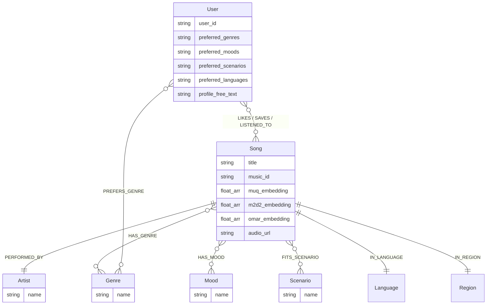

# 🎵 SoulTuner Agent

<p align="center">
  
</p>

<p align="center">
  <strong>Multimodal Music Recommendation Agent — Hybrid RAG × Knowledge Graph × Long-term Memory</strong>
</p>

<p align="center">
  
  
  
  
  
  
  <br/>
  
  
  
</p>

<p align="center">
  <a href="README.md">中文</a> | <a href="README_EN.md">English</a>
</p>

## 🎯 Discover Music with Natural Language, Let AI Truly Understand You

SoulTuner is a **locally-deployed** AI music recommendation agent. It's not just a simple "search → play" tool, but a personal DJ that **continuously learns your musical taste**:

- 🗣️ **Describe what you want to hear in natural language** — "I'm feeling really down today, I just want some quiet time alone." The system automatically identifies your emotion and scenario to recommend music that fits your current state.
- 🧠 **Understands you better the more you use it** — Every like, save, skip, and conversation silently builds your personalized music profile, making the next recommendation more accurate over time.
- 🌐 **Local library not enough? Real-time web search fallback** — Automatically searches the web for the latest music info when the local library falls short.
- 🗺️ **Immersive Music Journey** — Describe a story or scenario, and the AI will orchestrate a complete music journey with emotional arcs.
- ♻️ **Discover → Stage → Ingest** — Found a good song? It downloads to a "Pending" staging area first. Preview, then confirm ingestion with automatic acoustic analysis.

> 📖 For full features and interaction details, please refer to [Feature_Walkthrough.md](Feature_Walkthrough.md)
>
> Orchestrated via a LangGraph multi-node Agent workflow, integrating Neo4j, a MuQ-MuLan text-to-music anchor, M2D-CLAP / OMAR-RQ auxiliary representations, LLMs, and GraphZep long-term memory for multi-path retrieval, weighted RRF fusion, streaming recommendations, web fallback, music journeys, and a behavior data flywheel.

---

## 🚀 For Regular Users · Docker in 3 Steps

```powershell
Copy-Item .env.example .env
# Edit .env: at least fill NEO4J_PASSWORD and DASHSCOPE_API_KEY
.\soultuner.ps1 up cpu        # Full CPU experience: Neo4j + Backend + Frontend + GraphZep + SearxNG + Netease proxy
.\soultuner.ps1 doctor        # Open http://localhost:3003 after health checks pass
```

With an NVIDIA GPU, use `.\soultuner.ps1 up gpu`: the backend enables MuQ-MuLan fp16 and starts the separate ingestion worker. CPU mode keeps the complete product workflow but automatically uses the lighter M2D text-to-music fallback so the 663M MuQ model cannot exhaust Docker memory.

<details>
<summary>Local development / GPU ingestion / manual steps</summary>

- Local development: create the `music_agent` Conda environment, install Python dependencies and `web/` dependencies, then run `python startup_all.py`.
- Model cache: Docker allows the first run to download a missing HuggingFace text encoder so vector retrieval works out of the box. For fully offline runs, execute `python scripts/download_models.py` first and set `HF_OFFLINE=true` in `.env`.
- GPU ingestion: online recommendation does not require a GPU; lyrics tagging, audio vectors, and batch ingestion are handled by `.\soultuner.ps1 up gpu` or `.\soultuner.ps1 ingest gpu`.
- Manual ports: Neo4j `:7687`, GraphZep `:3100`, Backend `:8501`, Frontend `:3003`.

</details>

---

## ✨ Core Features

| Feature | Description |
|---|---|
| 🔀 **Hybrid RAG** | Parallel graph / dense / BM25 / personal / cold-start recall, weighted RRF fusion + tri-anchor reranking |
| 🎵 **Multimodal Text-to-Music** | MuQ-MuLan is the Chinese-strong primary recall model, M2D-CLAP is the fallback, and OMAR-RQ adds acoustic similarity |
| 🧠 **Long-term Memory** | GraphZep dual-stage recall with circuit-breaker fallback, retaining user preferences across sessions |
| 📊 **Coarse Rank + Explore** | Graph Affinity coarse ranking cutoff + Thompson Sampling cold-start exploration slots |
| 🤖 **Smart Intent Recognition** | Layered intent plan: `hard_constraints / soft_intent / hints` + multi-turn inheritance |
| 👤 **User Profile** | Frontend visual profile panel (Genre/Emotion/Scenario/Language) → Neo4j + GraphZep dual write |
| 🌐 **Web Search Fallback** | SearxNG federated search + LLM summarization when the local library is insufficient |
| 🎼 **Music Journey** | LLM Story → Emotion breakdown → Step-by-step retrieval, real-time SSE streaming |
| ♻️ **Data Flywheel** | Download → Stage → Preview → Confirm Ingest → Tag extraction → Vector encoding → Neo4j |
| 📋 **Library Mgmt** | Pending staging area + My Library full-graph management (search/play/delete) |
| 📡 **SSE Streaming** | Real-time frontend rendering: thinking process → song cards → recommendation reasons |
| 🐳 **Docker Deployment** | `docker compose up` one-click full-stack startup |

---

## 🖼️ Feature Preview

<div align="center">
<h3>🎬 Explore SoulTuner's Features</h3>
<p>
  <a href="https://www.bilibili.com/video/BV11dQLBDEeF/">
    
  </a>
</p>
</div>

### 🏠 Home · 💬 Chat · 🎵 Recommend · 🎧 Player · 🗺️ Journey

<table>
  <tr>
    <td></td>
    <td></td>
  </tr>
  <tr>
    <td></td>
    <td></td>
  </tr>
  <tr>
    <td colspan="2"></td>
  </tr>
</table>

---

## 🏗️ System Architecture

```text
┌─────────────────────────────────────────────────────────────────────┐
│  Frontend (Next.js :3003)                                           │
│  React UI  ·  Global Audio Player  ·  Music Journey  ·  Settings   │
└──────────────────────────────┬──────────────────────────────────────┘
                               │ SSE
┌──────────────────────────────▼──────────────────────────────────────┐
│  Backend (FastAPI :8501)                                            │
│  SSE Streaming API  ·  Settings API  ·  Static Audio Server        │
└──────────────────────────────┬──────────────────────────────────────┘
                               │
┌──────────────────────────────▼──────────────────────────────────────┐
│  LangGraph Agent (StateGraph)                                       │
│                                                                     │
│  start → GraphZep Recall → Planner (LLM) → Intent Router          │
│                                                                     │
│     ┌─────────┬─────────┬─────────┬──────────┐                     │
│     ▼         ▼         ▼         ▼          ▼                     │
│  search_songs  chat  acquire  gen_reco  journey                    │
│     │                                                               │
│     ▼                                                               │
│  Hybrid Retrieval ──→ LLM Explainer ──→ Pref Extract ──→ GraphZep Write → end │
└──────────────────────────────┬──────────────────────────────────────┘
                               │
┌──────────────────────────────▼──────────────────────────────────────┐
│  Hybrid Retrieval Engine                                            │
│                                                                     │
│  GraphRAG · Dense KNN · BM25 · Personal · Cold-start · Web Fallback│
│         └──────────────────┬───────────────────┘                   │
│                            ▼                                        │
│              Weighted RRF Fusion (keeps per-source ranks)            │
│                            ▼                                        │
│              Coarse Rank (Graph Affinity cutoff)                     │
│                            ▼                                        │
│              Thompson Sampling (cold-start exploration slots)        │
│                            ▼                                        │
│              Tri-Anchor Rerank (Semantic+Acoustic+Personal norm.)    │
│                            ▼                                        │
│              MMR Multi-dim Diversity (λ=0.7)                       │
└─────────────────────────────────────────────────────────────────────┘
                               │
┌──────────────────────────────▼──────────────────────────────────────┐
│  Storage Layer                                                      │
│  Neo4j (Graph + Vectors)  ·  GraphZep Memory (:3100)               │
└─────────────────────────────────────────────────────────────────────┘
```

### Tech Stack

| Layer | Technology |
|---|---|
| **Frontend** | Next.js 14 + React 18 |
| **Agent** | LangGraph StateGraph (layered intent planning + multi-recall routing) |
| **Backend** | FastAPI + SSE Streaming |
| **Graph Database** | Neo4j 5.x (Native Vector Index + Graph Relations + User Behavior direct-write) |
| **Audio Embeddings** | MuQ-MuLan (primary text-to-music, 512d) + M2D-CLAP (semantic fallback/rerank, 768d) + OMAR-RQ (acoustic auxiliary, 1024d) |
| **LLMs** | Default `dashscope / qwen3.7-plus`; other providers are advanced overrides |
| **Long-term Memory**| GraphZep temporal memory (Dual-stage recall) |
| **Web Search** | SearxNG federated search + Tavily + Zhipu WebSearch |
| **Ranking Algorithm**| Tri-Anchor Normalized Rerank (Semantic+Acoustic+Personal) + Graph Affinity Coarse Rank + Thompson Sampling + MMR |
| **Context Management**| GSSC Token budget pipeline (Gather/Select/Structure/Compress + async pre-compression) |
| **Containerization** | Docker Compose CPU/GPU entrypoints; CPU includes the full online stack, GPU adds the ingestion worker |

> 📖 See [tests/eval/README.md](tests/eval/README.md) for recommendation-quality and alignment evaluation commands.

---

## 🔬 Technical Depth

### RAG Hybrid Retrieval Pipeline

```text
User Query → Planner (LLM) outputs a layered plan
               ↓  hard_constraints + soft_intent + hints + intent_type
    ┌──────────┬──────────┬──────────┬──────────┬──────────┐
    ▼          ▼          ▼          ▼          ▼
 GraphRAG   Dense KNN    BM25     Personal   Cold-start    ← Step 1: parallel recall
 (Neo4j)   (MuQ+OMAR) (title/artist/lyrics) (profile/logs) (explore)
    └──────────┴──────────┴──────────┴──────────┴──────────┘
               ▼
   Step 2: Weighted RRF fusion            ← Preserves per-source rank and source metadata
               ▼
   Step 3: hard_constraints + DISLIKES    ← Only hard filter; mood/scenario/genre stay soft
               ▼
   Step 4: Artist Diversity Filter        ← ≤ N songs per artist (exception for specific queries)
               ▼
   Step 5: Coarse Rank + TS Explore       ← Graph Affinity + Thompson Sampling long-tail rescue
               ▼
   Step 6: Tri-Anchor Normalized Rerank   ← Auxiliary semantic(M2D-CLAP) + Acoustic(OMAR-RQ) + Personal
               ▼
   Step 7: MMR Multi-dim Diversity + FinalCut
```

**Key Design Decisions**:

- **Layered Intent Plan**: The Planner outputs `hard_constraints / soft_intent / hints`. Entities, language, and instrumental constraints are hard filters; mood, scenario, and vibe are ranking signals.
- **Five Parallel Recall Paths**: Graph entities/tags, MuQ-MuLan text-to-music search, BM25 lexical search, personalization, and cold-start exploration always run; `intent_type` only adjusts weights.
- **Weighted RRF Fusion**: Candidates are merged with `weight / (60 + rank)`, preserving source rank and source metadata instead of equal merging.
- **Three-model roles**: MuQ-MuLan is the default text-to-music anchor; M2D-CLAP remains available for recall fallback and semantic reranking; OMAR-RQ supplies text-independent acoustic similarity.
- **Coarse Rank + Thompson Sampling**: Graph Affinity scored cutoff (`coarse_cut_ratio=65%`), tail candidates rescued via TS sampling (`Beta(α,β)` distribution) for exploration-exploitation balance.
- **Tri-Anchor Normalized Reranking**: Auxiliary semantic anchor `(cosine+1)/2` (M2D-CLAP) + acoustic anchor `(cosine+1)/2` (OMAR-RQ centroid) + personal anchor `MinMax` (Graph Affinity), normalized to [0,1] before weighted fusion.
- **Deployable fallback**: `DENSE_TEXT_AUDIO_BACKEND=muq|m2d|both`; a missing MuQ model/index or encoding failure automatically falls back to M2D, while lazy loading keeps the default memory footprint bounded.
- **DST Multi-turn Inheritance**: Planner preserves the previous layered plan across turns and adds new constraints from follow-up queries.
- **MMR Jaccard**: Re-ranking using the `{genre, mood, theme, scenario}` multidimensional tags for candidate diversity.

### Agent Workflow


> Intent recognition, HyDE, and explanation generation default to `dashscope / qwen3.7-plus`. Other providers should be changed only through `.env` or the frontend Advanced Settings.

> `web_search` intent now routes **directly to the `web_fallback` node** (Online Music API live search), bypassing HybridRetrieval entirely. Supports Chinese-first query extraction, multi-level fallback query resolution, and 30-second preview detection.

> Preference extraction is governed by a decoupled `extract_preferences` node; general chat intents automatically bypass it.

### Memory System

| Component | Description |
|---|---|
| **GraphZep Dual-stage** | Stage 1 Coarse Recall → Stage 2 Rerank (Similarity + Time Decay), retaining user preferences across sessions |
| **GSSC Token Budget** | Dynamic memory assignment for facts + chat_history, LLM summarization + async pre-compression caching |
| **Neo4j Preference Graph** | Auto-extract user preferences from chat, async write to Neo4j User nodes; behavior events (like/save/skip/dislike) directly write relationship edges |
| **User Profile Dual-write** | Frontend visual profile panel → Writes to Neo4j User node properties + GraphZep long-term memory simultaneously |
| **Profile Synthesizer** | Dynamic profile synthesis: aggregates long-term memory + behavioral stats (played/liked/skipped counts) → auto-generates a structured user portrait injected into each Planner prompt |

**Memory Architecture Highlights**:
- **Neo4j** handles precise behavioral relationships (LIKES / SAVES / LISTENED_TO / SKIPPED / DISLIKES) with fast Bolt direct-write (~100ms)
- **GraphZep** manages fuzzy semantic memory (natural language descriptions of user preferences) retrieved via BGE-M3 vectors, supplementing Planner context
- **Profile Synthesizer** asynchronously aggregates both memory sources per conversation turn, generating a readable `portrait` injected into the current Planner system prompt

### User Profile System

The frontend profile panel saves preferences (genre/mood/scenario/language), simultaneously committing to the Neo4j `User` node and GraphZep. Graph Affinity reads these attributes during retrieval, rendering Jaccard similarity scores to bubble up favored tracks. The Profile Synthesizer automatically aggregates behavioral statistics and memory snapshots to provide personalized context injection for every conversation.

### Data Flywheel

User search → Discover new song → Download to "Pending" staging area → Frontend preview & playback → Select and confirm ingestion → LLM label extraction + Dual vector encoding → Neo4j ingestion → Discoverable next time.

> 💡 Songs acquired from the web no longer auto-ingest. Users manage ingested songs from the "My Library" page (search/play/delete).

### Engineering Quality

| Dimension | Description |
|---|---|
| **CI/CD** | GitHub Actions — Auto runs `ruff` linting and `pytest` unit tests |
| **Unit Testing** | 141 tests covering settings loading, Planner cache, outcome eval, fusion filters, explanation fast-mode, and more |
| **Outcome Eval** | `evaluate_outcomes` measures whether returned songs satisfy the user's intent; current splits are 56 dev cases and 24 holdout cases |
| **Token Tracking** | Built-in structured Token consumption reports in GSSC pipelines |
| **State Persistence** | LangGraph MemorySaver Checkpoint (in-memory, replaceable with DB adapters) |
| **Code Standards** | Enforced by Ruff static analysis + pyproject.toml |

<details>
<summary>Outcome Eval Details</summary>

```powershell
python -m tests.eval.evaluate_outcomes --split dev --planner-temperature 0 --fast
python -m tests.eval.evaluate_outcomes --split holdout --planner-temperature 0 --fast
```

The harness checks whether returned songs satisfy artist, title, language, playability, negation, soft intent, and fallback behavior. After S4, the suite includes 10 English mirror cases: English totals `8/10`, non-English totals `64/70`, so A2 language normalization was not triggered.

The legacy `evaluate_intent.py` remains useful only as a route-label regression check; it is no longer used as evidence of recommendation quality. See `tests/eval/README.md` for details.

</details>

---

## 📊 Neo4j Knowledge Graph



**Vector Indices**: `song_muq_index` (512d, cosine, primary text-to-music) + `song_m2d2_index` (768d, cosine, fallback/rerank) + `song_omar_index` (1024d, cosine, acoustic auxiliary).

---

## 🧰 Startup And Ingestion Reference

For everyday use, the 3-step Docker block near the top is enough. The commands below keep only two startup modes: CPU and GPU.

| Command | Purpose |
|---|---|
| `.\soultuner.ps1 up cpu` | Full CPU online stack: Neo4j + Backend + Frontend + GraphZep + SearxNG + Netease proxy container |
| `.\soultuner.ps1 up gpu` | CPU stack + separate ingestion worker for lyrics tags, audio vectors, and batch ingest |
| `.\soultuner.ps1 doctor` | Environment diagnosis and next-step hints |
| `.\soultuner.ps1 test` | Unit tests |
| `.\soultuner.ps1 mock` | End-to-end mock run without external services |
| `.\soultuner.ps1 ingest gpu` | Process the ingestion queue with the GPU worker |

<details>
<summary>First-time model cache and data ingestion</summary>

```powershell
conda create -n music_agent python=3.11
conda activate music_agent
pip install -r requirements.txt
python scripts/download_models.py
.\soultuner.ps1 ingest gpu
```

Online recommendation only reads mounted model caches. Batch lyrics tagging, audio-vector extraction, and new-song ingestion are handled by the GPU worker so day-to-day recommendation does not depend on GPU work.

</details>

<details>
<summary>Local development / manual startup</summary>

```powershell
cd web
npm install
cd ..
python startup_all.py
```

| Service | Port |
|---|---|
| Neo4j Bolt / Browser | `7687` / `7474` |
| GraphZep | `3100` |
| Backend | `8501` |
| Frontend | `3003` |
| SearxNG | `8888` |

</details>

---
### Advanced: Local LLM Experiment (Optional)

DashScope is the recommended default. Switch providers only when you explicitly want to test a local model, from **Settings → Model Config → Advanced Options**.

1. **Terminal A (WSL)**: Start the local inference engine.

   ```bash
   wsl
   bash /path/to/SoulTuner-Agent/scripts/start_sglang.sh
   ```

2. **Frontend Advanced Options**: switch the specific model slot to `sglang`, then save.

---

## 📁 Project Structure

```
.
├── agent/                      # LangGraph Agent
│   ├── music_agent.py          # Native agent loop
│   └── music_graph.py          # StateGraph workflow with layered intent routing
│
├── api/                        # FastAPI Interfaces
│   ├── server.py               # Gateway & Settings API
│   └── user_profile.py         # User Preferences API (GET/POST /api/user-profile)
│
├── config/settings.py          # Global Pydantic configs (Runtime patchable)
│
├── retrieval/                  # Engine abstractions
│   ├── hybrid_retrieval.py     # Multi-path Fusion + Coarse Rank(Graph Affinity+TS) + Tri-Anchor Rerank + MMR
│   ├── gssc_context_builder.py # GSSC pipeline (Budgeting + Abstract Context mapping)
│   ├── muq_embedder.py         # MuQ-MuLan 24kHz audio/text encoder (lazy-loaded)
│   ├── audio_embedder.py       # M2D-CLAP fallback and semantic rerank encoder
│   ├── neo4j_client.py         # Node connectivity definitions
│   ├── music_journey.py        # Journey architect algorithms
│   └── user_memory.py          # Neo4j Preferences & Logs
│
├── tools/                      # Tool executions
│   ├── graphrag_search.py      # Neo4j Cypher definitions
│   ├── semantic_search.py      # MuQ primary, M2D fallback, OMAR-assisted retrieval
│   ├── web_search_aggregator.py# SearxNG + Tavily routers
│   └── acquire_music.py        # Flywheel tools (download to staging + on-demand ingest)
│
├── llms/                       # LLMs
│   ├── prompts.py              # LLM Prompts
│   ├── registry.py             # Provider registry + env injection
│   ├── chat_models.py          # LangChain ChatModel factories
│   ├── native.py               # Native LiteLLM caller
│   └── multi_llm.py            # Backward-compatible facade
│
├── schemas/                    # Pydantic schemas
├── services/                   # Outer microservice bindings
├── data/pipeline/              # DB ingest pipelines
├── web/                        # Next.js Frontend
│   ├── components/Settings/    # ⚙️ Settings interface
│   ├── components/Profile/     # 👤 User Profile interface
│   └── components/Navigation/  # Nav layout views
│   └── app/library/            # Library pages (Pending / My Library / Likes / Collections)
│
├── graphzep_service/           # Micro node for GraphZep
├── tests/                      # Testing & Eval
│   ├── unit/                   # 141 pytest tests
│   └── eval/                   # Outcome eval harness (evaluate_outcomes.py)
├── .github/workflows/ci.yml    # GitHub Actions definitions
├── docker-compose.yml          # Container configuration
├── Dockerfile                  # API Engine definitions
├── pyproject.toml              # Ruff + Pytest syntax bounds
├── .env.example                # Templates
└── startup_all.py              # OS unified boot pipeline
```

---

## ⚙️ Configuration

### Environment Variables

| Property | Description | Default |
|---|---|---|
| `DASHSCOPE_BASE_URL` | DashScope API base | `https://dashscope.aliyuncs.com/compatible-mode/v1` |
| `DASHSCOPE_API_KEY` | DashScope API key | — |
| `MODEL_NAME` | Main reasoning model | `qwen3.7-plus` |
| `NEO4J_URI` | Neo4j bindings | `neo4j://127.0.0.1:7687` |
| `NEO4J_PASSWORD` | Neo4j security parameters | — |
| `DENSE_TEXT_AUDIO_BACKEND` | Text-to-music backend | `muq` (Docker CPU automatically uses `m2d`; `both` optional) |
| `RECALL_SOURCE_TIMEOUT_SECONDS` | Per-recall timeout | `60` (covers MuQ cold loading) |
| `TAVILY_API_KEY` | Cloud indexing rules | Optional |

MuQ-MuLan processes 24kHz audio and loads on demand. This project measured about 2.75GB peak VRAM in fp32 and about 1.4GB in fp16. `up gpu` exposes the GPU to the backend and enables fp16, while `up cpu` selects M2D to avoid an unresponsive CPU container during MuQ cold loading. MuQ weights use **CC-BY-NC 4.0** and therefore are restricted to non-commercial use unless separately licensed.

---

## 🙏 Acknowledgements

Architectural inspiration was expanded heavily upon [imagist13/Muisc-Research](https://github.com/imagist13/Muisc-Research).

| Project | Purpose |
|---|---|
| [aexy-io/graphzep](https://github.com/aexy-io/graphzep) | Core graph storage structure representations |
| [OpenMuQ/MuQ](https://github.com/OpenMuQ/MuQ) | MuQ-MuLan primary text-to-music model (CC-BY-NC 4.0) |
| [nttcslab/m2d](https://github.com/nttcslab/m2d) | M2D-CLAP fallback and auxiliary semantics |
| [MTG/omar](https://github.com/MTG/omar) | Raw acoustics implementations |

---

## 📚 References

1. Niizumi, D. et al. (2025). *M2D-CLAP: Exploring General-purpose Audio-Language Representations Beyond CLAP.*
2. Alonso-Jiménez, P. et al. (2025). *OMAR-RQ: Open Music Audio Representation Model Trained with Multi-Feature Masked Token Prediction.*
3. Rasmussen, P. et al. (2025). *Zep: A Temporal Knowledge Graph Architecture for Agent Memory.*
4. Palumbo, E. et al. (Spotify, 2025). *You Say Search, I Say Recs: A Scalable Agentic Approach to Query Understanding and Exploratory Search.* (RecSys 2025)
5. D'Amico, E. et al. (Spotify, 2025). *Deploying Semantic ID-based Generative Retrieval for Large-Scale Podcast Discovery at Spotify.*
6. Penha, G. et al. (2025). *Semantic IDs for Joint Generative Search and Recommendation.* (RecSys 2025 LBR)
7. Palumbo, E. et al. (2025). *Text2Tracks: Prompt-based Music Recommendation via Generative Retrieval.*
8. Xu, S. et al. (2025). *Climber: Toward Efficient Scaling Laws for Large Recommendation Models.*
9. Wang, S. et al. (2025). *Knowledge Graph Retrieval-Augmented Generation for LLM-based Recommendation.* (ACL 2025)

---

## 📄 License

MIT License

⚠️ **Disclaimer**: Produced and maintained solely for machine learning research applications and architectural experimentation limits. **Strictly NO commercial use**. Does not offer indexing mechanisms for commercialized data files.
