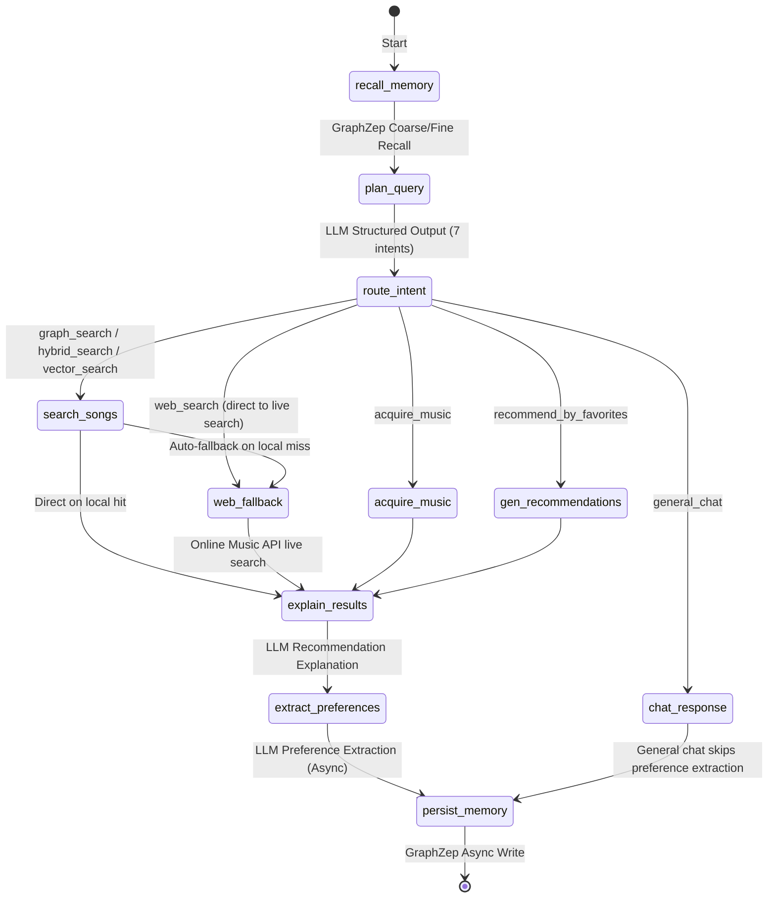
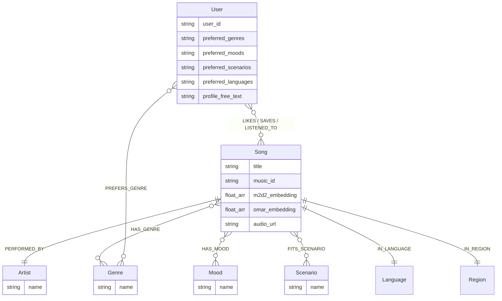

# 🎵 SoulTuner Agent

<p align="center">
  
</p>

<p align="center">
  <strong>Multimodal Music Recommendation Agent — Hybrid RAG × Knowledge Graph × Long-term Memory</strong>
</p>

<p align="center">
  
  
  
  
  
  
  <br/>
  
  
  
</p>

<p align="center">
  <a href="README.md">中文</a> | <a href="README_EN.md">English</a>
</p>

## 🎯 Discover Music with Natural Language, Let AI Truly Understand You

SoulTuner is a **locally-deployed** AI music recommendation agent. It's not just a simple "search → play" tool, but a personal DJ that **continuously learns your musical taste**:

- 🗣️ **Describe what you want to hear in natural language** — "I'm feeling really down today, I just want some quiet time alone." The system automatically identifies your emotion and scenario to recommend music that fits your current state.
- 🧠 **Understands you better the more you use it** — Every like, save, skip, and conversation silently builds your personalized music profile, making the next recommendation more accurate over time.
- 🌐 **Local library not enough? Real-time web search fallback** — Automatically searches the web for the latest music info when the local library falls short.
- 🗺️ **Immersive Music Journey** — Describe a story or scenario, and the AI will orchestrate a complete music journey with emotional arcs.
- ♻️ **Discover → Stage → Ingest** — Found a good song? It downloads to a "Pending" staging area first. Preview, then confirm ingestion with automatic acoustic analysis.

> 📖 For full features and interaction details, please refer to [Feature_Walkthrough.md](Feature_Walkthrough.md)
>
> Orchestrated via LangGraph multi-node Agent workflow, integrating Knowledge Graph (Neo4j), Dual-model audio embeddings (M2D-CLAP + OMAR-RQ), LLM, and GraphZep long-term memory to achieve multi-path hybrid retrieval, weighted RRF fusion, Neo4j graph distance weighting, SSE streaming recommendations, web search fallback, music journey orchestration, and a user behavior data flywheel.

---

## ✨ Core Features

| Feature | Description |
|---|---|
| 🔀 **Hybrid RAG** | Concurrent GraphRAG + Semantic Search, equal-merge dedup + tri-anchor normalized reranking |
| 🎵 **Dual Audio Embeddings**| M2D-CLAP cross-modal semantics + OMAR-RQ acoustic features, tri-anchor normalized fusion (weights adjustable) |
| 🧠 **Long-term Memory** | GraphZep dual-stage recall, retaining user preferences across sessions |
| 📊 **Coarse Rank + Explore** | Graph Affinity coarse ranking cutoff + Thompson Sampling cold-start exploration slots |
| 🤖 **Smart Intent Recognition** | 7-class intent + DST multi-turn tag inheritance, supporting both API LLMs + local Qwen3-4B |
| 👤 **User Profile** | Frontend visual profile panel (Genre/Emotion/Scenario/Language) → Neo4j + GraphZep dual write |
| 🌐 **Web Search Fallback** | SearxNG federated search + LLM summarization when the local library is insufficient |
| 🎼 **Music Journey** | LLM Story → Emotion breakdown → Step-by-step retrieval, real-time SSE streaming |
| ♻️ **Data Flywheel** | Download → Stage → Preview → Confirm Ingest → Tag extraction → Vector encoding → Neo4j |
| 📋 **Library Mgmt** | Pending staging area + My Library full-graph management (search/play/delete) |
| 📡 **SSE Streaming** | Real-time frontend rendering: thinking process → song cards → recommendation reasons |
| 🐳 **Docker Deployment** | `docker compose up` one-click full-stack startup |

---

## 🖼️ Feature Preview

<div align="center">
<h3>🎬 Explore SoulTuner's Features</h3>
<p>
  <a href="https://www.bilibili.com/video/BV11dQLBDEeF/">
    
  </a>
</p>
</div>

### 🏠 Home · 💬 Chat · 🎵 Recommend · 🎧 Player · 🗺️ Journey

<table>
  <tr>
    <td></td>
    <td></td>
  </tr>
  <tr>
    <td></td>
    <td></td>
  </tr>
  <tr>
    <td colspan="2"></td>
  </tr>
</table>

---

## 🏗️ System Architecture

```text
┌─────────────────────────────────────────────────────────────────────┐
│  Frontend (Next.js :3003)                                           │
│  React UI  ·  Global Audio Player  ·  Music Journey  ·  Settings   │
└──────────────────────────────┬──────────────────────────────────────┘
                               │ SSE
┌──────────────────────────────▼──────────────────────────────────────┐
│  Backend (FastAPI :8501)                                            │
│  SSE Streaming API  ·  Settings API  ·  Static Audio Server        │
└──────────────────────────────┬──────────────────────────────────────┘
                               │
┌──────────────────────────────▼──────────────────────────────────────┐
│  LangGraph Agent (StateGraph)                                       │
│                                                                     │
│  start → GraphZep Recall → Planner (LLM) → Intent Router          │
│                                                                     │
│     ┌─────────┬─────────┬─────────┬──────────┐                     │
│     ▼         ▼         ▼         ▼          ▼                     │
│  search_songs  chat  acquire  gen_reco  journey                    │
│     │                                                               │
│     ▼                                                               │
│  Hybrid Retrieval ──→ LLM Explainer ──→ Pref Extract ──→ GraphZep Write → end │
└──────────────────────────────┬──────────────────────────────────────┘
                               │
┌──────────────────────────────▼──────────────────────────────────────┐
│  Hybrid Retrieval Engine                                            │
│                                                                     │
│  ┌─────────────┐  ┌──────────────────┐  ┌──────────────┐          │
│  │  GraphRAG   │  │  Semantic Search │  │  Web Search  │          │
│  │  Neo4j      │  │  M2D-CLAP+OMAR   │  │  SearxNG     │          │
│  └──────┬──────┘  └────────┬─────────┘  └──────┬───────┘          │
│         └──────────────────┼───────────────────┘                   │
│                            ▼                                        │
│              Merge & Dedup (Equal Merge & Deduplication)             │
│                            ▼                                        │
│              Coarse Rank (Graph Affinity cutoff)                     │
│                            ▼                                        │
│              Thompson Sampling (cold-start exploration slots)        │
│                            ▼                                        │
│              Tri-Anchor Rerank (Semantic+Acoustic+Personal norm.)    │
│                            ▼                                        │
│              MMR Multi-dim Diversity (λ=0.7)                       │
└─────────────────────────────────────────────────────────────────────┘
                               │
┌──────────────────────────────▼──────────────────────────────────────┐
│  Storage Layer                                                      │
│  Neo4j (Graph + Vectors)  ·  GraphZep Memory (:3100)               │
└─────────────────────────────────────────────────────────────────────┘
```

### Tech Stack

| Layer | Technology |
|---|---|
| **Frontend** | Next.js 14 + React 18 |
| **Agent** | LangGraph StateGraph (7-class intent routing) |
| **Backend** | FastAPI + SSE Streaming |
| **Graph Database** | Neo4j 5.x (Native Vector Index + Graph Relations + User Behavior direct-write) |
| **Audio Embeddings** | M2D-CLAP 2025 (Cross-modal semantics, 768d) + OMAR-RQ (Acoustic features, 1024d) |
| **LLMs** | DeepSeek-V3.2 / Gemini / Doubao / Qwen (API) + Qwen3-4B (SGLang Local) |
| **Long-term Memory**| GraphZep temporal memory (Dual-stage recall) |
| **Web Search** | SearxNG federated search + Tavily + Zhipu WebSearch |
| **Ranking Algorithm**| Tri-Anchor Normalized Rerank (Semantic+Acoustic+Personal) + Graph Affinity Coarse Rank + Thompson Sampling + MMR |
| **Context Management**| GSSC Token budget pipeline (Gather/Select/Structure/Compress + async pre-compression) |
| **Containerization** | Docker Compose (Neo4j + GraphZep + Backend + Frontend) |

> 📖 For full tech stack and frontend engineering details, see [Technical_Report.md](Technical_Report.md)

---

## 🔬 Technical Depth

### RAG Hybrid Retrieval Pipeline

```text
User Query → Planner (LLM) + DST multi-turn tag inheritance
               ↓  intent_type + retrieval_plan
    ┌──────────┼──────────┐
    ▼          ▼          ▼
 GraphRAG   VectorKNN  WebSearch       ← Step 1: Concurrent Recall
 (Cypher)  (M2D+OMAR)  (SearxNG)
    └──────────┼──────────┘
               ▼
   Step 2: Merge & Deduplicate           ← Replaces legacy weighted RRF
               ▼
   Step 2.5: DISLIKES Filter             ← Exclude explicitly disliked songs
               ▼
   Step 3: Artist Diversity Filter       ← ≤ N songs per artist (Exception for specific queries)
               ▼
   Step 4: Coarse Rank + TS Explore      ← Graph Affinity sort → keep 65% → tail Thompson Sampling rescue
               ▼
   Step 5: Tri-Anchor Normalized Rerank  ← Semantic(M2D-CLAP) + Acoustic(OMAR-RQ) + Personal(Graph Affinity MinMax)
               ▼
   Step 6: MMR Multi-dim Diversity       ← Relies on genre + mood + theme + scenario
               ▼
   Step 7: FinalCut (≤ 15 tracks)        ← Final safety truncation
```

**Key Design Decisions**:

- **GraphRAG Typed Entity Matching**: The Planner now splits extracted entities into `graph_artist_entities` (artist names) and `graph_song_entities` (song/album titles). GraphRAG executes precise AND matching (`Artist.name AND Song.title`) replacing the legacy flat-tag OR fuzzy matching. This drastically reduces cross-contamination from same-name artists/songs. Both Chinese and English aliases must be included to support the bilingual graph.
- **GraphRAG 5-Dimensional Tag Filtering**: Beyond Typed Entity, 5-dimensional tag filtering (genre / scenario / mood / language / region) is preserved, with 200+ EN/ZH alias mappings.
- **Dual Vector Models**: M2D-CLAP cross-modal semantics + OMAR-RQ acoustics, tri-anchor normalized reranking fusion.
- **Coarse Rank + Thompson Sampling**: Graph Affinity scored cutoff (`coarse_cut_ratio=65%`), tail candidates rescued via TS sampling (`Beta(α,β)` distribution) for exploration-exploitation balance.
- **Tri-Anchor Normalized Reranking**: Semantic anchor `(cosine+1)/2` (M2D-CLAP) + Acoustic anchor `(cosine+1)/2` (OMAR-RQ centroid) + Personal anchor `MinMax` (Graph Affinity), all normalized to [0,1] then weighted fusion (frontend-tunable, auto-normalized so α+β+γ=1).
- **DST Multi-turn Tag Inheritance**: Planner preserves previous `retrieval_plan` state (genre/mood/language/acoustic semantics) across turns, automatically augmenting new constraints on follow-up queries (e.g., prev=Pop → follow-up "sadder" → keep Pop + add Sad).
- **MMR Jaccard**: Re-ranking using the `{genre, mood, theme, scenario}` multidimensional tags for candidate diversity.

### Agent Workflow



> Intent recognition supports both API LLMs (DeepSeek-V3.2, etc.) and local Qwen3-4B modes (deployed via SGLang). In local mode, the HyDE acoustic text is generated by an independent module.

> `web_search` intent now routes **directly to the `web_fallback` node** (Online Music API live search), bypassing HybridRetrieval entirely. Supports Chinese-first query extraction, multi-level fallback query resolution, and 30-second preview detection.

> Preference extraction is governed by a decoupled `extract_preferences` node; general chat intents automatically bypass it.

### Memory System

| Component | Description |
|---|---|
| **GraphZep Dual-stage** | Stage 1 Coarse Recall → Stage 2 Rerank (Similarity + Time Decay), retaining user preferences across sessions |
| **GSSC Token Budget** | Dynamic memory assignment for facts + chat_history, LLM summarization + async pre-compression caching |
| **Neo4j Preference Graph** | Auto-extract user preferences from chat, async write to Neo4j User nodes; behavior events (like/save/skip/dislike) directly write relationship edges |
| **User Profile Dual-write** | Frontend visual profile panel → Writes to Neo4j User node properties + GraphZep long-term memory simultaneously |
| **Profile Synthesizer** | Dynamic profile synthesis: aggregates long-term memory + behavioral stats (played/liked/skipped counts) → auto-generates a structured user portrait injected into each Planner prompt |

**Memory Architecture Highlights**:
- **Neo4j** handles precise behavioral relationships (LIKES / SAVES / LISTENED_TO / SKIPPED / DISLIKES) with fast Bolt direct-write (~100ms)
- **GraphZep** manages fuzzy semantic memory (natural language descriptions of user preferences) retrieved via BGE-M3 vectors, supplementing Planner context
- **Profile Synthesizer** asynchronously aggregates both memory sources per conversation turn, generating a readable `portrait` injected into the current Planner system prompt

### User Profile System

The frontend profile panel saves preferences (genre/mood/scenario/language), simultaneously committing to the Neo4j `User` node and GraphZep. Graph Affinity reads these attributes during retrieval, rendering Jaccard similarity scores to bubble up favored tracks. The Profile Synthesizer automatically aggregates behavioral statistics and memory snapshots to provide personalized context injection for every conversation.

### Data Flywheel

User search → Discover new song → Download to "Pending" staging area → Frontend preview & playback → Select and confirm ingestion → LLM label extraction + Dual vector encoding → Neo4j ingestion → Discoverable next time.

> 💡 Songs acquired from the web no longer auto-ingest. Users manage ingested songs from the "My Library" page (search/play/delete).

### Engineering Quality

| Dimension | Description |
|---|---|
| **CI/CD** | GitHub Actions — Auto runs `ruff` linting and `pytest` unit tests |
| **Unit Testing** | 51 tests across 5 modules (key formatting, Token budget, alias mapping, dedup, schemas) |
| **Intent Eval** | 55 human-annotated queries, covering all 7 intents. Achieved **98.2%** accuracy (54/55) |
| **Token Tracking** | Built-in structured Token consumption reports in GSSC pipelines |
| **State Persistence** | LangGraph MemorySaver Checkpoint (in-memory, replaceable with DB adapters) |
| **Code Standards** | Enforced by Ruff static analysis + pyproject.toml |

<details>
<summary>Intent Classification Eval Details</summary>

```text
Eval Date: 2026-04-09
Model: DeepSeek-V3.2 (SiliconFlow)
Test set: 55 annotated queries (tests/eval/intent_test_queries.json)

Intent Type          Correct   Total   Accuracy
────────────────────────────────────────────────
graph_search              15      15     100.0%
hybrid_search             19      20      95.0%
vector_search              6       6     100.0%
web_search                 4       4     100.0%
general_chat               4       4     100.0%
acquire_music              3       3     100.0%
recommend_by_favorites     3       3     100.0%
────────────────────────────────────────────────
TOTAL                     54      55      98.2%
Avg. Latency: 11.55s/query (Includes classification + NER + extraction + HyDE generation, single LLM call)
```

Run evaluations:

```bash
python -m tests.eval.evaluate_intent --provider siliconflow
```

</details>

---

## 📊 Neo4j Knowledge Graph



**Vector Indices**: `song_m2d2_index` (768d, cosine) + `song_omar_index` (1024d, cosine)

---

## 🚀 Quick Start

Deployment takes 3 steps: **① Preparation** → **② Select Deployment Method** → **③ Data Ingestion**.

---

### Step 1: Preparation (Required for both methods)

**1.1 Music Data**: Place MP3 files in the `data/processed_audio/audio/` directory (Customizable via `.env`).

**1.2 Environment Variables**:

```bash
cp .env.example .env
# Edit .env: Fill in SiliconFlow_API_KEY and NEO4J_PASSWORD at minimum
```

**1.3 Model Weights Download** (Required once, takes ~**2.4 GB**):

```bash
# Set up Python env (Required later for Data Ingestion)
conda create -n music_agent python=3.11 && conda activate music_agent
pip install -r requirements.txt

# Download model weights (Skips existing files automatically)
python scripts/download_models.py
```

| Model | Size | Purpose | Path |
|---|---|---|---|
| M2D-CLAP 2025 | ~1.6 GB | Runtime Text/Audio cross-modal encoding & Dual-anchor reranking | `~/.cache/m2d_clap/` |
| BERT-base-uncased | ~440 MB | M2D-CLAP internal text encoder | `~/.cache/huggingface/` |
| OMAR-RQ multicodebook | ~400 MB | Feature extractor during audio ingestion | `~/.cache/huggingface/` |

> 💡 GraphZep embeddings invoke the SiliconFlow API (`BAAI/bge-m3`) directly, no download required.

---

### Step 2: Select Deployment Method

<table>
<tr><th></th><th>Method A: Docker Compose (Recommended)</th><th>Method B: Local Conda</th></tr>
<tr><td><b>Best For</b></td><td>Quick evaluation, demo deployment</td><td>Daily development, code debugging</td></tr>
<tr><td><b>Neo4j</b></td><td>Built-in container, starts automatically</td><td>Install <a href="https://neo4j.com/download/">Neo4j Desktop</a> and start manually</td></tr>
<tr><td><b>GraphZep</b></td><td>Built-in container, starts automatically</td><td>Auto-started by <code>startup_all.py</code></td></tr>
</table>

#### Method A: Docker Compose (Recommended)

> Backend image is ~**11 GB** (PyTorch + M2D-CLAP libs). Model weights are cached natively on host volume instead of packed.
>
> ⚠️ **GPU Requirement**: NVIDIA GPU acceleration enabled by default for M2D cross-modal encoding. Ensure you have the [NVIDIA Container Toolkit](https://docs.nvidia.com/datacenter/cloud-native/container-toolkit/install-guide.html). (Comment out `deploy.resources` in docker-compose.yml if you strictly have no GPU).

```bash
# Update .env mappings printed by download_models.py:
#   MUSIC_DATA_PATH   = Data Directory
#   M2D_CLAP_CACHE    = M2D Model Cache 
#   HF_HOME           = HuggingFace Cache

# 1-Click Startup
docker compose up -d

# ★ Track backend startup natively (Observe warmup progress)
docker logs -f soultuner-backend

# You'll see:
#   🚀 Initializing crucial components...
#   ✅ M2D-CLAP Preloaded (14.9s)
#   ✅ Agent Configured (14.9s)
#   ✅ Neo4j established (15.8s)
#   🏁 Startup executed in 15.8s.
# Ctrl+C to stop tailing logs (Doesn't stop containers)

# Verify services
docker compose ps

# Access Links:
# Frontend: http://localhost:3003 | Backend API: http://localhost:8501 | Neo4j: http://localhost:7474
```

<details>
<summary>Docker DevOps Cheatsheet</summary>

| Command | Description |
|---|---|
| `docker logs -f soultuner-backend` | Track backend logs |
| `docker compose up -d --build backend` | Rebuild and restart backend |
| `docker compose restart backend` | Restart backend without rebuild |
| `docker compose down` | Tear down containers |
| `docker compose down -v` | Erase containers and volumes (⚠️ Deletes Neo4j schema) |

</details>

#### Method B: Local Conda

> ⚠️ You must install [Neo4j Desktop](https://neo4j.com/download/) and run it. Pass the auth details to `NEO4J_URI` & `NEO4J_PASSWORD` in `.env`.

```bash
# We created the Conda environment in Step 1.
# Pre-install frontend modules:
cd web && npm install && cd ..

# One-command bootstrapper (Backend + Frontend + GraphZep + SearxNG)
python startup_all.py

# Or separated tabs:
conda activate music_agent; python startup_all.py --no-web    # Tab A: Backend & DBs
cd web && npm run dev                                         # Tab B: Frontend (HMR)
```

<details>
<summary>Full Manual Orchestration</summary>

| Terminal | Command | Port |
|---|---|---|
| 0 | Start Neo4j DB | `:7687` |
| 1 | `cd graphzep_service/server && npm run dev` | `:3100` |
| 2 | `python start.py --mode api` | `:8501` |
| 3 | `cd web && npm run dev` | `:3003` |
| 4 | `docker compose -f docker-compose.searxng.yml up -d` | `:8888` |

</details>

Proceed to **Step 3 Data Ingestion** upon successfully starting.

---

### Step 3: Data Ingestion (Required Once)

Neo4j natively launches as a fresh empty database. You MUST execute data population pipelines before generating recommendations.

```bash
conda activate music_agent

# ── Docker deployments require explicit Neo4j pointer ──
# Linux/Mac:
export NEO4J_URI=bolt://127.0.0.1:7687 NEO4J_PASSWORD=12345678
# Windows PowerShell:
# $env:NEO4J_URI="bolt://127.0.0.1:7687"; $env:NEO4J_PASSWORD="12345678"

# ── Local Deployments use .env ──

# 1. Lyrics Tag Extraction (LLM automated, skip if lyrics_analysis.json exists)
python data/pipeline/lyrics_analyzer.py

# 2. Ingest to Neo4j (Metadata + Lyrics Tags + Audio Vectors, GPU recommended)
python data/pipeline/ingest_to_neo4j.py

# If no GPU (Skip vectors, writes metadata and tags only, takes mere minutes)
python data/pipeline/ingest_to_neo4j.py --skip-embeddings

# Retroactively calculate vectors:
python data/pipeline/ingest_to_neo4j.py --update-embeddings
```

> ✅ Persists persistently to Neo4j (Docker explicit volumes or Local Desktop). Running again is unnecessary across boots.
> 📖 Read [Technical_Report.md](Technical_Report.md) for full dataset/schema administration.

---

### Optional: Local LLM Deployment (WSL + SGLang)

Hardware-accelerated deployment workflow for 8GB VRAM cards (e.g., RTX 4070), providing local reasoning via Qwen3-4B logic bounds in intent determination.

1. **Terminal A (WSL)**: Ignite inference engine.

   ```bash
   wsl
   bash /path/to/SoulTuner-Agent/scripts/start_sglang.sh
   ```

2. **Terminal B (Windows)**: Swap UI Config parameters.
   - Boot up `python startup_all.py`
   - Access UI Settings ⚙️ → **Main Provider** → Select `sglang` → Save.

---

## 📁 Project Structure

```
.
├── agent/                      # LangGraph Agent
│   ├── music_agent.py          # Native agent loop
│   └── music_graph.py          # StateGraph definitions (7 intent routing schemas)
│
├── api/                        # FastAPI Interfaces
│   ├── server.py               # Gateway & Settings API
│   └── user_profile.py         # User Preferences API (GET/POST /api/user-profile)
│
├── config/settings.py          # Global Pydantic configs (Runtime patchable)
│
├── retrieval/                  # Engine abstractions
│   ├── hybrid_retrieval.py     # Multi-path Fusion + Coarse Rank(Graph Affinity+TS) + Tri-Anchor Rerank + MMR
│   ├── gssc_context_builder.py # GSSC pipeline (Budgeting + Abstract Context mapping)
│   ├── audio_embedder.py       # M2D-CLAP mappings
│   ├── neo4j_client.py         # Node connectivity definitions
│   ├── music_journey.py        # Journey architect algorithms
│   └── user_memory.py          # Neo4j Preferences & Logs
│
├── tools/                      # Tool executions
│   ├── graphrag_search.py      # Neo4j Cypher definitions
│   ├── semantic_search.py      # M2D-CLAP + OMAR Vector implementations
│   ├── web_search_aggregator.py# SearxNG + Tavily routers
│   └── acquire_music.py        # Flywheel tools (download to staging + on-demand ingest)
│
├── llms/                       # LLMs
│   ├── prompts.py              # LLM Prompts
│   └── multi_llm.py            # Langchain providers (SiliconFlow/Volcengine/Gemini/OpenAI)
│
├── schemas/                    # Pydantic schemas
├── services/                   # Outer microservice bindings
├── data/pipeline/              # DB ingest pipelines
├── web/                        # Next.js Frontend
│   ├── components/Settings/    # ⚙️ Settings interface
│   ├── components/Profile/     # 👤 User Profile interface
│   └── components/Navigation/  # Nav layout views
│   └── app/library/            # Library pages (Pending / My Library / Likes / Collections)
│
├── graphzep_service/           # Micro node for GraphZep
├── tests/                      # Testing & Eval
│   ├── unit/                   # 51 pytest metrics
│   └── eval/                   # Benchmark tools (evaluate_intent.py)
├── .github/workflows/ci.yml    # GitHub Actions definitions
├── docker-compose.yml          # Container configuration
├── Dockerfile                  # API Engine definitions
├── pyproject.toml              # Ruff + Pytest syntax bounds
├── .env.example                # Templates
└── startup_all.py              # OS unified boot pipeline
```

---

## ⚙️ Configuration

### Environment Variables

| Property | Description | Default |
|---|---|---|
| `OPENAI_BASE_URL` | Global LLM path base | `https://api.siliconflow.cn/v1` |
| `OPENAI_API_KEY` | Core LLM gateway | — |
| `MODEL_NAME` | Main reasoning model | `deepseek-ai/DeepSeek-V3.2` |
| `VOLCENGINE_BASE_URL` | Volcengine path limits | `https://ark.cn-beijing.volces.com/api/v3` |
| `VOLCENGINE_API_KEY` | Volcengine Gateway | Optional |
| `NEO4J_URI` | Neo4j bindings | `neo4j://127.0.0.1:7687` |
| `NEO4J_PASSWORD` | Neo4j security parameters | — |
| `TAVILY_API_KEY` | Cloud indexing rules | Optional |
| `GOOGLE_API_KEY` | Gemini pipeline bindings | Optional |

> 📖 View configurable settings, weights metrics & configurations mapping in [Technical_Report.md](Technical_Report.md)

---

## 🙏 Acknowledgements

Architectural inspiration was expanded heavily upon [imagist13/Muisc-Research](https://github.com/imagist13/Muisc-Research).

| Project | Purpose |
|---|---|
| [aexy-io/graphzep](https://github.com/aexy-io/graphzep) | Core graph storage structure representations |
| [nttcslab/m2d](https://github.com/nttcslab/m2d) | M2D-CLAP vectors & representation rules |
| [MTG/omar](https://github.com/MTG/omar) | Raw acoustics implementations |

---

## 📚 References

1. Niizumi, D. et al. (2025). *M2D-CLAP: Exploring General-purpose Audio-Language Representations Beyond CLAP.*
2. Alonso-Jiménez, P. et al. (2025). *OMAR-RQ: Open Music Audio Representation Model Trained with Multi-Feature Masked Token Prediction.*
3. Rasmussen, P. et al. (2025). *Zep: A Temporal Knowledge Graph Architecture for Agent Memory.*
4. Palumbo, E. et al. (Spotify, 2025). *You Say Search, I Say Recs: A Scalable Agentic Approach to Query Understanding and Exploratory Search.* (RecSys 2025)
5. D'Amico, E. et al. (Spotify, 2025). *Deploying Semantic ID-based Generative Retrieval for Large-Scale Podcast Discovery at Spotify.*
6. Penha, G. et al. (2025). *Semantic IDs for Joint Generative Search and Recommendation.* (RecSys 2025 LBR)
7. Palumbo, E. et al. (2025). *Text2Tracks: Prompt-based Music Recommendation via Generative Retrieval.*
8. Xu, S. et al. (2025). *Climber: Toward Efficient Scaling Laws for Large Recommendation Models.*
9. Wang, S. et al. (2025). *Knowledge Graph Retrieval-Augmented Generation for LLM-based Recommendation.* (ACL 2025)

---

## 📄 License

MIT License

⚠️ **Disclaimer**: Produced and maintained solely for machine learning research applications and architectural experimentation limits. **Strictly NO commercial use**. Does not offer indexing mechanisms for commercialized data files.
